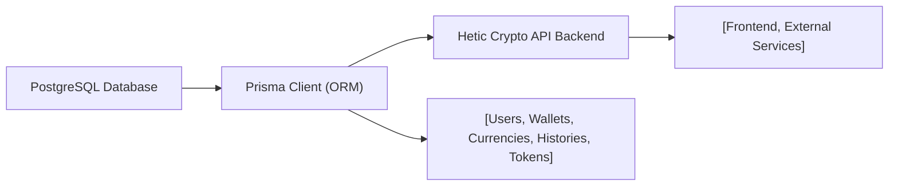

# Database Module

## Overview

The Database module provides a structured data layer for the Hetic Crypto API, managing storage, retrieval, and relationships for core entities such as users, wallets, cryptocurrencies, and authentication tokens. This module uses PostgreSQL as its underlying database and Prisma ORM for type-safe data access, establishing a robust foundation for all backend features, including user accounts, wallet operations, cryptocurrency tracking, and history management.

## Key Features

- **User and Authentication Management**:  
  Handles user records, user roles (ADMIN/USER), email verification status, passwords, and manages refresh tokens for stateless authentication.

- **Wallet Tracking**:  
  Connects users to multiple wallets, each uniquely identified by address, and logs changes in wallet balances and values over time.

- **Cryptocurrency Support**:  
  Maintains information about various cryptocurrencies (symbol, name), tracks their price changes through a historical record for trend analysis and valuations.

- **Transaction and Price History**:  
  Records wallet history entries (quantity and value held per currency per date) and cryptocurrency price history (price per currency per date), supporting auditing and analytics.

- **Relational Integrity**:  
  Ensures strong data relationships and referential integrity across all key entities using foreign keys and unique constraints (e.g., unique emails, wallet addresses, currency symbols).

## System Errors

- **Unique Constraint Violations**:  
  Errors occur when attempting to insert duplicate values for fields such as user email, wallet address, currency symbol, or refresh token.  
  *Resolution*: Ensure values are unique before creation; handle and surface unique constraint errors gracefully in API/client.

- **Foreign Key Constraints**:  
  Errors when referencing non-existent users, wallets, or currencies in history or token tables.  
  *Resolution*: Validate the existence of referenced records prior to insertion or update.

- **Missing Required Fields**:  
  Required fields (such as `title` in Wallet, `symbol` in Currency, or `quantity/value` in WalletHistory) must be provided; otherwise, validation or database errors are triggered.  
  *Resolution*: When creating or updating records, supply all required data as defined by the schema.

## Usage Examples

```typescript
// Accessing Prisma Client for queries
import { prisma } from '../src/lib/prisma';

// Create a new user
const user = await prisma.user.create({
  data: {
    email: 'alice@example.com',
    password: 'securepassword',
    name: 'Alice',
  },
});

// Add a wallet for the user
const wallet = await prisma.wallet.create({
  data: {
    userId: user.id,
    address: '0x1234abcd',
    title: 'Alice Main Wallet',
  },
});

// Record a wallet history entry
await prisma.walletHistory.create({
  data: {
    walletId: wallet.id,
    currencyId: 1,             // existing currency record
    date: new Date(),
    quantity: 1.5,
    value: 52000,
  },
});

// Add a new currency and its historical price
const currency = await prisma.currency.create({
  data: {
    symbol: 'BTC',
    name: 'Bitcoin',
  },
});
await prisma.currencyHistory.create({
  data: {
    currencyId: currency.id,
    date: new Date(),
    price: 52000,
  },
});
```

## System Integration



- **Dependencies**: PostgreSQL Database (schema), Prisma Client (type-safe queries)
- **This Module**: Prisma-based data model mapped to core business entities
- **Used By**: All backend API logic (user auth, wallet ops, price/history, etc.)
- **Consumers**: Frontend clients, admin panels, and integration services via the backend API

---

This module underpins all persistent data storage and access patterns within the Hetic Crypto API platform, ensuring consistency, integrity, and scalability.