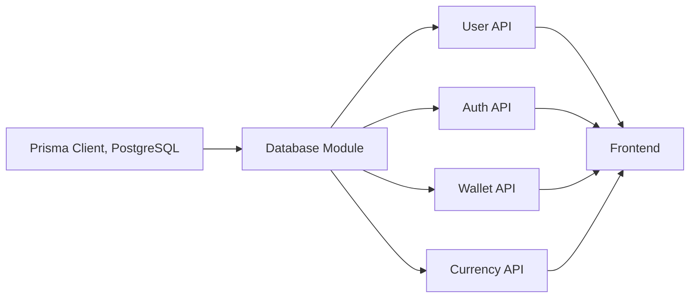

# Database Module

## Overview
The Database module serves as the central data storage and access layer for the Hetic Crypto API. It uses PostgreSQL for persistent storage and Prisma ORM for type-safe access to data. This module manages users, authentication tokens, wallets, currency data, and historical records for both wallets and currencies. It provides structured models and relationships that the backend relies on for all persistent operations.

## Key Features

- **User & Role Management**: 
  Stores user accounts, roles (admin/user), email verification status, and authentication details. Supports unique identification and secure password storage.

- **Authentication Tokens**: 
  Manages refresh tokens with expiration for secure, stateless authentication in API sessions.

- **Wallet Management**: 
  Persists user wallets with unique addresses and titles, supporting multiple wallets per user.

- **Wallet History Tracking**: 
  Records periodic snapshots of each wallet's currency balances and value over time for audit and statistics.

- **Currency Directory**: 
  Maintains list of supported cryptocurrencies, each identified by a unique symbol and optional name.

- **Currency History Tracking**: 
  Stores time-series price data for each currency, supporting accurate value computation and historical analysis.

- **Data Integrity & Uniqueness**: 
  Enforces uniqueness (e.g., user emails, wallet addresses, currency symbols), and relational constraints to ensure consistency across all entities.

## System Errors

- **Unique Constraint Violations**:  
  Occur when attempting to insert duplicate emails, wallet addresses, currency symbols, or duplicate currency history records per timestamp.  
  _Resolution_: Ensure values (email, address, symbol) are unique before attempting to create new records.

- **Foreign Key Violations**:  
  Triggered when referencing non-existent users, currencies, or wallets in related tables like histories.  
  _Resolution_: Always check that referenced records exist before creating dependent entries.

- **Missing Required Fields**:  
  Raised when omitting mandatory data like wallet titles, currency symbols, or history values.  
  _Resolution_: Supply all required fields as defined in the schema/model.

- **Invalid Authentication/Refresh Token**:  
  Returned when tokens are expired, missing, or not matching any database record.  
  _Resolution_: Refresh tokens in a timely manner and maintain secure token lifecycle management.

## Usage Examples

```javascript
// 1. Creating a new user with a wallet
const newUser = await prisma.user.create({
  data: {
    email: "alice@example.com",
    password: "hashed-password",
    wallets: {
      create: [
        { address: "wallet123", title: "Main Wallet" }
      ]
    }
  }
});

// 2. Adding a new currency and storing its price history
const currency = await prisma.currency.create({
  data: {
    symbol: "BTC",
    name: "Bitcoin"
  }
});

await prisma.currencyHistory.create({
  data: {
    date: new Date(),
    price: 30000.0,
    currencyId: currency.id
  }
});

// 3. Recording wallet value history
await prisma.walletHistory.create({
  data: {
    date: new Date(),
    quantity: 1.25,
    value: 37500.0,
    walletId: newUser.wallets[0].id,
    currencyId: currency.id
  }
});
```

## System Integration


- **Dependencies**: Integrates Prisma Client (ORM) with a PostgreSQL database.
- **Used By**: Exposes structured data operations to core API modules (user, auth, wallet, currency endpoints).
- **Consumers**: All backend API routes and indirectly, frontend clients via API responses.