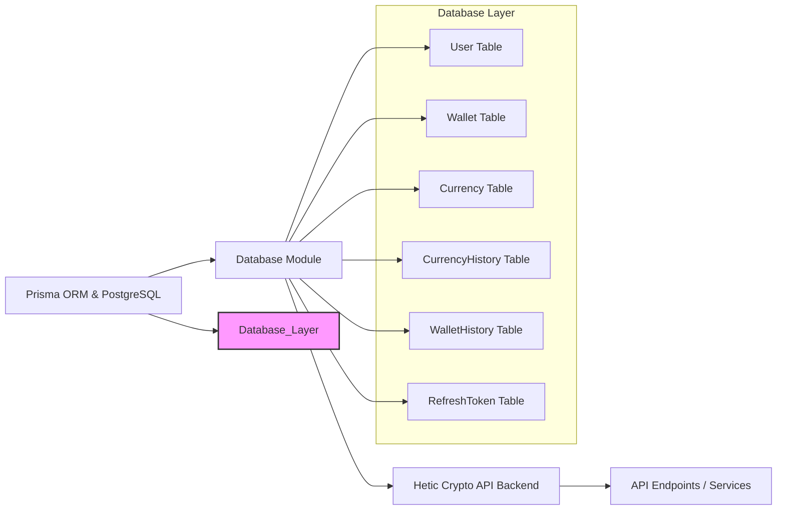

# Database Module

## Overview
The Database module manages all persistent data storage and retrieval for the Hetic Crypto API. It leverages PostgreSQL and Prisma ORM to provide structured access to users, wallets, cryptocurrencies, and historical data relevant to the application. This module is foundational, ensuring consistent and secure data operations that power authentication, wallet management, currency tracking, and audit histories.

## Key Features
- **User Management**: Securely stores user data, roles, and authentication credentials. Supports email verification and multiple security roles (ADMIN, USER).
- **Wallet Tracking**: Records wallets per user, each identified by a unique address and user-defined title. Links every wallet to its owner for multi-wallet access.
- **Wallet Activity History**: Tracks changes in wallet balances over time, associating each record with a specific date, cryptocurrency, and value, enabling accurate historical analysis.
- **Cryptocurrency Catalog**: Maintains centralized information about supported currencies, including unique symbols and descriptive names.
- **Currency Price History**: Logs historical pricing data for each supported cryptocurrency with timestamps. Allows time-based analysis and reporting.
- **Authentication Refresh Tokens**: Supports session management and secure user authentication with refresh tokens tied to user records.
- **Centralized API Access**: Exposes public Prisma ORM APIs for all entities, providing a consistent interface for all database operations across the system.

## System Errors
- **Unique Constraint Violations**:  
  - Description: Attempting to create a user, wallet, or cryptocurrency with a duplicate unique field (e.g., email, wallet address, currency symbol).
  - Resolution: Ensure submitted fields are unique. Catch and handle unique constraint errors on the API layer to notify users accordingly.
- **Foreign Key Constraint Failures**:  
  - Description: Trying to reference or delete an entity that is linked elsewhere (e.g., deleting a user with active wallets).
  - Resolution: Use proper deletion flows (cascade or restrict) and always check related records before removing critical entities.
- **Missing Required Fields**:
  - Description: Attempting to insert or update records without mandatorily required fields (e.g., wallet title, symbol for currency).
  - Resolution: Validate data before database operations; required fields must always be provided by the client/system.
- **Authentication or Token Expiry**:
  - Description: Accessing protected routes with expired or invalid refresh tokens.
  - Resolution: Prompt for re-login or generate a new token following valid authentication workflows.

## Usage Examples
Practical code examples demonstrating API usage:

```typescript
// Import PrismaClient
import { prisma } from '../lib/prisma';

// Create a new user
const newUser = await prisma.user.create({
  data: {
    email: "user@example.com",
    password: "hashed_password",
    name: "Alice",
    role: "USER",
  },
});

// Add a wallet for the user
const wallet = await prisma.wallet.create({
  data: {
    address: "0xABC123...",
    title: "Main Wallet",
    userId: newUser.id,
  },
});

// Record wallet history (deposit or withdrawal)
await prisma.walletHistory.create({
  data: {
    date: new Date(),
    quantity: 2.5,
    value: 5000,
    currencyId: 1,     // assuming BTC or similar
    walletId: wallet.id,
  },
});

// Fetch all price history for a cryptocurrency
const btcHistory = await prisma.currencyHistory.findMany({
  where: { currencyId: 1 },
  orderBy: { date: 'asc' },
});
```

## System Integration


