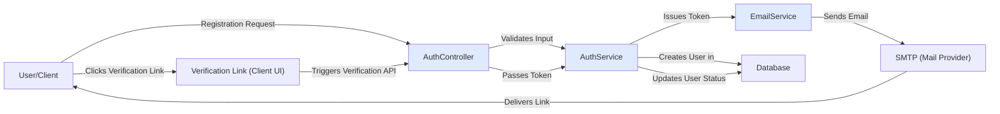

# Email Flow

## Overview
The Email Flow module manages all user email-related processes within the authentication lifecycle, primarily focused on email verification. This ensures that new users validate their email address before accessing protected system features. It integrates with user registration, email verification, and leverages SMTP providers to deliver critical communication.

## Key Features
- **Verification Email Dispatch**: Automatically sends a verification email to new users upon registration, containing a unique tokenized link.
- **Email Verification Handling**: Validates the user's email once they click the link, updating their status in the system.
- **Secure Token Management**: Embeds secure, expiring tokens in verification links to ensure authenticity and prevent misuse.
- **Integration with Auth Flows**: Tightly coupled with registration and login, requiring email verification before access is granted.

## System Errors
- **Failed to Send Verification Email**: Occurs when there is an SMTP issue or misconfiguration.
  - *Resolution*: Check SMTP configuration in environment variables (`SMTP_HOST`, `SMTP_PORT`); review provider status.
- **Email Already Registered**: Triggered when a registration attempt uses an existing email.
  - *Resolution*: Ensure the new user does not use existing emails; suggest password recovery if needed.
- **Verification Link Expired or Invalid**: Happens if the verification token is invalid or expired.
  - *Resolution*: User should re-initiate the registration or request a new verification link.
- **Email Not Verified Attempted Login**: Prevents users from logging in before verification.
  - *Resolution*: User must complete email verification via the link provided.

## Usage Examples

```typescript
// Registration triggers email verification flow
await authController.register(req, res); 
// Response: { message: "Registration successful. Please verify your email." }

// User receives email and visits link: https://client.url/verify-email/<token>
// The system validates the token from the link
await authController.verifyEmail(req, res);
// Response: { message: "Email verified successfully" }
```

## System Integration


