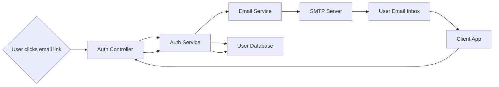

# Email Verification

## Overview
The Email Verification module ensures user account authenticity by requiring new users to verify their email address as part of the registration and authentication workflow. It sends a unique verification link to the user's email and processes the verification when the link is accessed. The module acts as a bridge between user registration, email dispatch, and user activation, enhancing account security and reducing fraudulent sign-ups.

## Key Features
- **Automated Email Dispatch**: Sends a verification email with a unique, time-limited token to new users after registration.
- **Token-Based Verification**: Confirms a user's email when they follow the verification link, activating the account.
- **Integration with Authentication**: Prevents unverified users from logging in or accessing the system.

## System Errors
- **Email Already Registered**: Returned if a registration is attempted with an existing email address.  
  *Resolution*: Use a different email address or recover the existing account.
- **Failed to Send Verification Email**: Occurs if the email dispatch cannot complete (e.g., SMTP issues).  
  *Resolution*: Check SMTP server configuration and connectivity.
- **Invalid or Expired Verification Token**: Returned if the token in the verification link is invalid or expired.  
  *Resolution*: Request a new verification email via the registration flow.
- **Email Not Verified**: Returned when an unverified user attempts to log in.  
  *Resolution*: User must complete the email verification step before authentication.

## Usage Examples

```typescript
// Registering a new user (triggers email verification)
await fetch('/api/register', {
  method: 'POST',
  body: JSON.stringify({ email: 'user@example.com', password: 'P@ssw0rd', name: 'User' }),
  headers: { 'Content-Type': 'application/json' }
});
// => Response: { message: "Registration successful. Please verify your email." }

// Verifying email after user clicks the link sent to their inbox
await fetch('/api/verify-email/TOKEN_FROM_EMAIL', {
  method: 'POST'
});
// => Response: { message: "Email verified successfully" }

// Attempting to login without verification
await fetch('/api/login', {
  method: 'POST',
  body: JSON.stringify({ email: 'user@example.com', password: 'P@ssw0rd' }),
  headers: { 'Content-Type': 'application/json' }
});
// => Response: { message: "Please verify your email first" }
```

## System Integration


