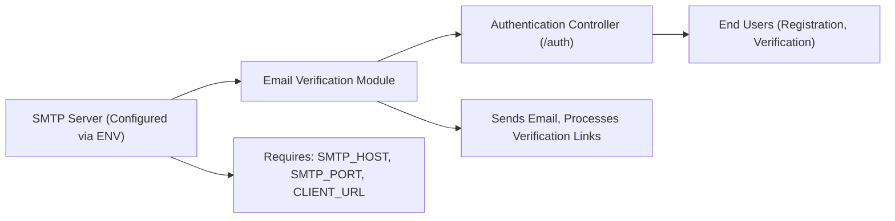

# Email Verification

## Overview
The Email Verification module enables user sign-up email validation as part of the authentication workflow. After registration, a verification email containing a unique link is sent to the user, requiring them to prove ownership of the provided email address before accessing protected features. This mechanism helps prevent spam accounts and ensures communication can be established with legitimate users.

## Key Features

- **Send Verification Emails**: Automatically sends a verification email containing a unique tokenized link to every new user upon successful registration.
- **Email Verification Endpoint**: Provides an endpoint to confirm email ownership when the user clicks the verification link. This completes the verification process in the backend.
- **Integration-Friendly**: Designed to fit seamlessly into existing authentication workflows and user management processes.
- **Configurable SMTP Support**: Uses environment-based SMTP configuration to support different email transport methods as needed by deployment environments.

## System Errors

- **Email Delivery Failure**: Occurs if the SMTP server is misconfigured or unavailable.
  - _Resolution_: Verify that `SMTP_HOST` and `SMTP_PORT` environment variables are set correctly and the mail server is reachable.
- **Invalid or Expired Verification Token**: Happens if the verification link is malformed, has expired, or the token is invalidated by the system.
  - _Resolution_: Ask the user to request a new verification email or verify that the token is being generated and stored properly in the system.
- **Email Already Verified/Error in Verification**: If the email is already verified or an error occurs during verification, the backend returns an appropriate error message.
  - _Resolution_: The client should display relevant feedback and possibly allow the user to reinitiate registration or login.

## Usage Examples

```typescript
// Registering a new user (triggers email verification)
await fetch('/api/auth/register', {
  method: 'POST',
  body: JSON.stringify({ name: "Jane Doe", email: "jane@mail.com", password: "safePassword123" }),
  headers: { "Content-Type": "application/json" }
});
// → Returns: 201 Created, instructs user to verify email

// Backend automatically sends email:
// To: jane@mail.com
// Subject: "Verify your email"
// Contains link: https://<client-url>/verify-email/<token>

// User clicks email link; frontend routes to verification endpoint
await fetch('/api/auth/verify-email/<token>');
// → Returns: 200 OK { message: "Email verified successfully" }
```

## System Integration


