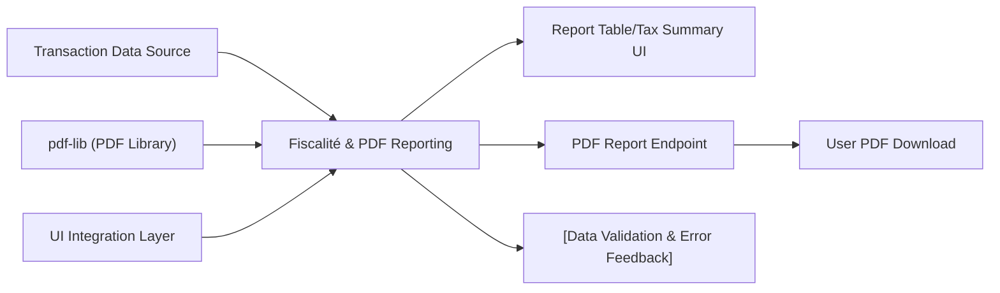

# Fiscalité & PDF Reporting Module

## Overview
The Fiscalité & PDF Reporting module enables users to track crypto taxation events and generate detailed fiscal gain/loss reports in PDF format. It is designed as a front-end component for managing transaction data, calculating taxable gains, and producing a compliant fiscal summary suitable for personal or regulatory purposes.

## Key Features
- **Fiscal Gain Calculation**: Computes taxable capital gains for each withdrawal based on portfolio value, transaction price, amount, and fees. Implements the French-specific calculation formula for determining the taxable portion.
- **Fiscal Summary Table**: Displays all user transactions (deposits and withdrawals) in a clear, sortable table with a calculated capital gain for each relevant operation.
- **Total Gain & Tax Overview**: Summarizes the total capital gains and the corresponding taxable amount (defaulted to 30%) for quick reference.
- **PDF Report Generation**: Allows users to generate and download a formatted PDF containing a complete breakdown of all transactions and the resulting fiscal summary, suitable for record-keeping or tax reporting.

## System Errors
- **PDF Generation Permission**: Browsers may block popups or file downloads required for PDF export.
  - **Resolution**: Ensure "allow popups" is enabled for the application; prompt user if a download fails.
- **Data Format Incompatibility**: Transactions with incorrect or incomplete data (e.g., missing date or invalid amount) could result in calculation or export errors.
  - **Resolution**: Input validation should ensure all required fields are present and correctly formatted before calculation or export actions.
- **Calculation Mismatch**: Fiscal gain calculations depend on portfolio snapshot logic; inconsistent or manipulated transaction data may lead to unexpected results.
  - **Resolution**: Audit and validate all transaction data for sequence and integrity.

## Usage Examples

```tsx
import Fiscalite from 'client/src/pages/Fiscalite';

/**
 * <Fiscalite /> automatically renders the following:
 * - Transaction table with calculated gains per withdrawal
 * - Total gains and taxable summary
 * - "Generate PDF" button for exporting fiscal report
 *
 * No extra configuration required for demo/fake data.
 */

// Usage in a protected/account page:
function AccountFiscalPage() {
  return (
    <div>
      <h1>Votre Fiscalité Crypto</h1>
      <Fiscalite />
    </div>
  );
}
```

## System Integration


- **Dependencies**: Consumes transaction data (in real usage: from a backend or local storage); leverages the `pdf-lib` library for PDF generation; is integrated into user-facing pages.
- **Used By**: Account/fiscality dashboard pages; enables financial/tax reporting features for end-users.
- **Process Details**: Validates transactions, calculates fiscal/tax metrics, renders results, and handles export workflow.