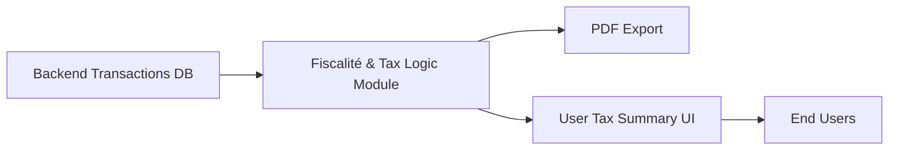

# Fiscalité & Tax Logic Module

## Overview
The Fiscalité & Tax Logic module provides an interactive crypto tax calculation report for end-users, helping them track their cryptocurrency transactions, compute realized capital gains, and generate compliant tax-ready summary reports in PDF. It is designed for web applications that need an on-demand crypto gain calculator and tax reporting workflow.

## Key Features
- **Transaction History Visualization**: Displays an organized table of user crypto transactions (deposit and withdrawal), including metadata and fee breakdowns.
- **Capital Gain Calculation**: Computes the taxable gain (plus-value) for each withdrawal operation. The gain calculation applies standard portfolio cost formulas, deducting fees accordingly.
- **Cumulative Gain and Tax Summary**: Aggregates all taxable gains and automatically derives the final taxable amount (e.g., with a flat tax rate, such as 30%).
- **PDF Report Generation**: Produces a dynamic PDF document summarizing all transactions, plus-value calculations, and fiscal impact. Users can download or preview the report for record-keeping or compliance.
- **User-Friendly Display**: All calculations and reports are accessible through an intuitive web interface, making it easy for users to view, verify, and export their tax data.

## System Errors
- **PDF Generation Failure**: If the browser or system blocks pop-ups or fails to load a PDF, users may not see their exported report.
  - **Resolution**: Ensure browser pop-ups are allowed; check for sufficient memory and compatible environments (desktop browsers recommended).
- **Incorrect Gain Calculation**: Calculation errors may arise if transaction data is missing, corrupt, or unordered.
  - **Resolution**: Validate transaction feed before display. Require deposits to be present before any withdrawal.
- **Date Formatting Errors**: Inconsistent date localization can cause confusion in the display or exported PDF.
  - **Resolution**: Standardize all dates with the correct locale before rendering or exporting.

## Usage Examples

```jsx
import Fiscalite from './pages/Fiscalite';

// Usage within a router or application component
function App() {
  return (
    <div>
      {/* The Fiscalite module presents the crypto tax workflow */}
      <Fiscalite />
    </div>
  );
}

// Generating the PDF report
// User clicks on the "Générer le PDF" button within the rendered Fiscalite component.
// The PDF is generated in-browser and opened in a new tab.
```

## System Integration



**Legend:**
- **Backend Transactions DB**: (Optional) In production, transaction data would be sourced from a backend or user wallet feed.
- **Fiscalité & Tax Logic Module**: This module consumes transactions, applies gain/tax logic, and prepares data for presentation/export.
- **PDF Export**: In-browser export of fiscal report, triggered by user action.
- **User Tax Summary UI**: Screens and tables summarizing calculations and history.
- **End Users**: Individuals needing tax statements or crypto gain analysis.