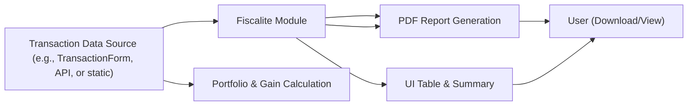

# Fiscalite (Crypto Tax Calculation)

## Overview
The **Fiscalite** module provides an interface and tools for users to analyze, calculate, and document capital gains (plus-values) on cryptocurrency transactions. It enables transparent tracking of deposits and withdrawals, computes taxable gains for each transaction, and allows users to generate a comprehensive PDF fiscal report. The purpose of this module is to facilitate fiscal compliance and reporting for users managing crypto portfolios.

## Key Features
- **Transaction Overview**: Display of all deposit and withdrawal transactions with relevant details (date, type, amount, price, fees).
- **Automatic Gain Calculation**: Computes the capital gains for each withdrawal transaction according to a standard fiscal formula, including calculation of total gains and relevant taxable amounts.
- **PDF Report Generation**: Generates and enables download of an official styled PDF report summarizing all transactions and fiscal calculations, suitable for accounting or tax declaration.
- **Integrated Transaction Entry** (when used with `TransactionForm`): Supports the addition of manual crypto transaction records for up-to-date calculations and reporting.

## System Errors
- **PDF Generation Failure**: If the PDF generation process encounters errors (for instance, due to browser compatibility or file saving issues), the report cannot be downloaded or viewed.
  - **Resolution**: Ensure browser supports PDF file generation (modern browsers required), and that pop-ups are not blocked for the site.
- **Invalid User Input** (when used with data entry forms): Incorrect transaction data (such as negative amounts, non-numeric values, or invalid dates) can prevent calculation or result in misleading fiscal reporting.
  - **Resolution**: Use input validation (as implemented in the forms) and guide users to enter all required fields with valid values.

## Usage Examples

```tsx
import Fiscalite from './pages/Fiscalite';

// Component usage in a page or route:
function App() {
  return (
    <div>
      <Fiscalite />
    </div>
  );
}
```

_Example with manual transaction entry, integrating `TransactionForm` for custom transaction input:_

```tsx
import React, { useState } from 'react';
import Fiscalite from './pages/Fiscalite';
import { TransactionForm, Transaction } from './components/TransactionForm';

function CryptoTaxPage() {
  const [transactions, setTransactions] = useState<Transaction[]>([]);

  const handleAddTransaction = (t: Transaction) => {
    setTransactions(prev => [...prev, t]);
  };

  return (
    <>
      <TransactionForm onAddTransaction={handleAddTransaction} />
      <Fiscalite transactions={transactions} />
    </>
  );
}
```

## System Integration



**Legend:**
- **Transaction Data Source**: Could be static, user-entered, or API-fetched transactions.
- **Fiscalite Module**: Core logic for displaying transactions, calculating gains, and controlling the workflow.
- **Portfolio & Gain Calculation**: Encapsulated logic used internally for fiscal calculations.
- **PDF Report Generation**: Converts calculation results and transaction history into a formal PDF document.
- **UI Table & Summary**: User interface displaying all transaction and fiscal summaries.
- **User**: End recipient of the information, interacting via the browser.

---

This structured approach ensures developers understand how the Fiscalite module fits into a broader crypto management or accounting application, how it can be extended, and how it interacts with user interface and data handling layers.