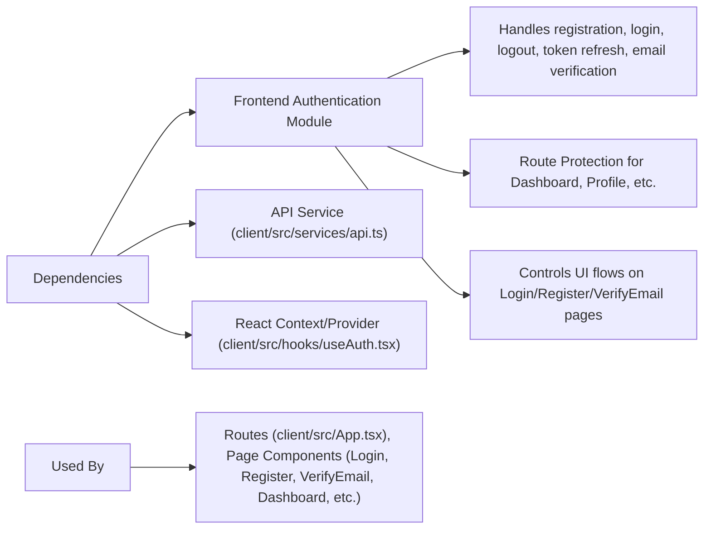

# Frontend Authentication

## Overview

The Frontend Authentication module manages user identity within the NicoooM/hetic-crypto-api client app. It secures protected routes, maintains authentication state, and supports registration, login, logout, and email verification flows. The module ensures only authenticated users can access sensitive features and interacts seamlessly with backend APIs to validate credentials and manage tokens.

## Key Features

- **User Registration**: Allows new users to sign up by submitting their name, email, and password. Handles client-side validation and error reporting before making API requests.
- **Login**: Facilitates user login by sending credentials to the backend and storing the received access token. Controls app state to reflect authentication status.
- **Logout**: Enables users to log out, clearing authentication tokens from local storage and resetting the UI.
- **Email Verification**: Processes verification tokens sent via email, confirms them with the backend, and updates the UI to reflect verification status.
- **Protected Routes**: Ensures that certain pages (dashboard, profile) are only accessible to authenticated users by leveraging React context and route guards.
- **Token Refresh Handling**: Automatically intercepts failed API requests that result from expired tokens and refreshes them using the backend endpoint, keeping users logged in without interruption.

## System Errors

- **Invalid Credentials**: Occurs if incorrect email or password are provided during login.  
  _Resolution:_ Display a relevant error message and re-prompt user for credentials.
- **Token Expiry**: Access token may expire, resulting in failed API requests (401/403 errors).  
  _Resolution:_ The system auto-refreshes tokens. If refresh fails, the user is redirected to login after a short delay.
- **Registration Errors**: Form errors such as "Passwords do not match" or backend validation failures (invalid email, weak password, duplicate email).  
  _Resolution:_ Client displays detailed errors. Submit the form again with corrected data.
- **Email Verification Failure**: Occurs if the token is invalid or expired.  
  _Resolution:_ Show an error message. User may request a new verification email.

## Usage Examples

```tsx
// Registration (client/src/pages/Register.tsx)
const handleSubmit = async (e) => {
  e.preventDefault();
  if (formData.password !== formData.confirmPassword) {
    setErrors("Passwords do not match.");
    return;
  }
  try {
    await API.post("/auth/register", {
      email: formData.email,
      password: formData.password,
      name: formData.name,
    });
    navigate("/login");
  } catch (error) {
    setErrors("Registration failed.");
  }
};
```

```tsx
// Login (client/src/pages/Login.tsx)
const { user, login } = useAuth();
const handleSubmit = async (e) => {
  e.preventDefault();
  try {
    await login(email, password);
  } catch (error) {
    // Show error message
  }
};
if (user) {
  return <Navigate to="/dashboard" />;
}
```

```tsx
// Route Protection (client/src/App.tsx)
<Route
  path="/dashboard"
  element={
    <ProtectedRoute>
      <Dashboard />
    </ProtectedRoute>
  }
/>
```

```tsx
// Email Verification (client/src/pages/VerifyEmail.tsx)
useEffect(() => {
  verifyEmail();
  navigate("/login");
}, [navigate]);
```

## System Integration


