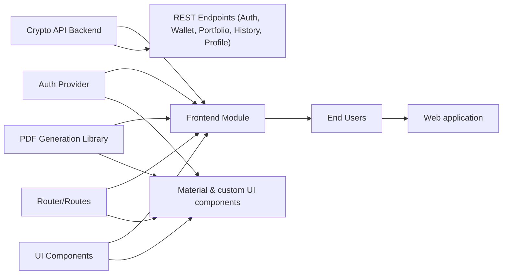

# Frontend Module Overview

## Overview
The **Frontend Module** provides the user interface for the crypto wallet system, enabling users to securely register, log in, view portfolio data, manage wallets, visualize transaction activity, and perform fiscal computations on their crypto assets. Implemented as a React single-page application, it orchestrates routing, API communication, and data rendering, serving as the primary touchpoint for end users with the underlying crypto API backend.

## Key Features

- **User Authentication & Registration**  
  Allows users to register new accounts, log in, and securely access protected dashboard features. Authentication state is managed at the app level and integrated throughout via protected routes.

- **Portfolio Dashboard**  
  Shows real-time and historical portfolio values, asset allocation, and trends using interactive visual elements (charts, tables) and wallet selection. Provides quick insights into holdings and their performance.

- **Wallet Management**  
  Lets users link, view, and remove multiple crypto wallets. Wallets are user-specific, enabling tailored portfolio tracking and multi-wallet management.

- **Profile & Security Settings**  
  Users can update personal details (name, email) and change their password directly from the frontend. Profile updates are reflected immediately, and password changes trigger re-authentication for security.

- **Graph Visualization**  
  Delivers advanced transaction visualization, allowing users to analyze patterns, flow, and network connections within their transaction history.

- **Fiscal Computation & PDF Export**  
  Calculates taxable gains/losses on withdrawals with a customizable transaction table. Users can generate downloadable PDF fiscal reports, facilitating compliance and record-keeping.

## System Errors

- **Authentication Failure**  
  - *Description*: Occurs when login credentials are invalid or session expires.  
  - *Resolution*: Prompt user to re-enter credentials; for expired sessions, redirect to login page.

- **API Data Fetch Errors**  
  - *Description*: Shown when portfolio, wallet, or profile data cannot be loaded due to server issues or connectivity problems.  
  - *Resolution*: Display error message and advise user to retry; data reloads automatically after network recovery.

- **Form Validation Errors**  
  - *Description*: Registration or password update fields may be rejected if they don’t meet requirements or confirmation does not match.  
  - *Resolution*: Highlight offending fields and provide user-friendly feedback (e.g., "Passwords do not match").

- **Wallet Operations Errors**  
  - *Description*: Errors may occur when adding or deleting wallets (e.g., invalid address, network failure).  
  - *Resolution*: Surface API error messages to the user and allow retry.

- **PDF Generation Errors**  
  - *Description*: If generating fiscal report PDF fails (browser issues, PDF library errors).  
  - *Resolution*: Advise user to refresh and retry; log for technical support if persistent.

## Usage Examples

```jsx
// Register a new user
import Register from './pages/Register';
// <Register /> renders the registration form and handles submissions.

// Log in
import Login from './pages/Login';
// <Login /> provides email/password login and routes to dashboard on success.

// Protected dashboard view
import Dashboard from './pages/Dashboard';
// <Dashboard /> displays portfolio, wallet selection, and historical charts.

// Profile management
import Profile from './pages/Profile';
// <Profile /> allows editing name, email, password, and wallet connections.

// View crypto transaction graph
import Graph from './pages/Graph';
// <Graph /> renders a transaction network visualization.

// Crypto fiscal computation and PDF export
import Fiscalite from './pages/Fiscalite';
// <Fiscalite /> calculates gains/losses and allows PDF report export.
```

## System Integration


