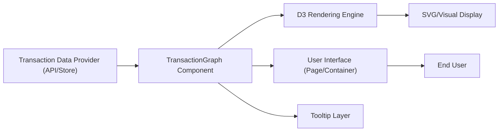

# Graph Visualization

## Overview
The Graph Visualization module provides an interactive visual representation of cryptocurrency transactions related to a user’s wallet. It allows users to explore and understand the flow of assets between wallets over time. This module is crucial for analysis, auditing, and tracking suspicious or significant transactional activities within the system.

## Key Features

- **Dynamic Transaction Graph**: Displays transactions as a node-link network, where each node represents a wallet or transaction, and each link is a transfer between them. The size and color of nodes convey additional information (e.g., main wallet, transaction value).
- **Time-based Animation**: The graph animates transactions incrementally along a timeline, enabling users to observe how wallet interactions evolve day by day.
- **Interactive Tooltips**: Hovering over nodes reveals detailed information such as wallet ID and transaction values, improving data transparency and investigation.
- **Progress Timeline**: A visual progress bar indicates the animation's current date, giving users temporal context for the data displayed.

## System Errors

- **Empty/Corrupt Data**: If no valid transaction or wallet data is available, the graph may render empty or incomplete. Resolution: Ensure the backend or data source provides the required nodes and links with proper date and value attributes.
- **D3 Render Failure**: When D3 cannot initialize the SVG (e.g., issues with DOM mounting or library import failures), the graph will not appear. Resolution: Check that dependencies (D3.js, React refs) are correctly installed and the component tree is rendered.
- **Performance Issues with Large Data Sets**: Rendering a large number of nodes/links may lead to UI freezes or sluggish animation. Resolution: Limit the data range, implement pagination, or optimize rendering.

## Usage Examples

```jsx
// Import the graph visualization component
import TransactionGraph from "../components/TransactionGraph";

// Use within a page or container
function GraphPage() {
  return (
    <div className="min-h-screen w-full bg-white p-8">
      <h1>Visualisation des transactions</h1>
      <div className="bg-gray-100 rounded-lg p-6 h-[680px]">
        <TransactionGraph />
      </div>
    </div>
  );
}
```

## System Integration



- **Dependencies**: Module relies on up-to-date transaction data (e.g., via API, store, or props), React for component structure, and D3.js for rendering.
- **This Module (TransactionGraph)**: Central visualization engine, integrating data and rendering logic.
- **Used By**: Any React page or dashboard component needing visual transaction insights.
- **Consumers**: End-users, analysts, auditors, or administrators using the web interface to monitor or investigate transaction flows.