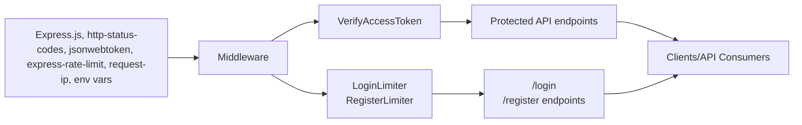

# Middleware

## Overview
This module provides middleware components designed to secure and protect API endpoints in the system. It focuses on two core areas: authenticating users via JWT tokens and enforcing rate limits to prevent abuse of authentication and registration endpoints. Middleware is used in the request pipeline to ensure that only valid and authorized requests reach protected resources, and to defend against brute-force and denial-of-service attacks.

## Key Features

- **Access Token Verification**: Ensures incoming requests contain a valid JWT access token, granting access to protected API routes for authenticated users only.
- **Login Rate Limiting**: Restricts the number of login attempts from a single IP within a defined time window, mitigating brute-force attacks.
- **Registration Rate Limiting**: Limits the number of registration requests from a single IP, preventing abuse and spam signups.

## System Errors

- **Unauthorized (401)**: Returned when the request lacks a valid `Authorization` header or the header is not in the `Bearer <token>` format.  
  *Resolution:* Ensure the request includes a valid access token in the `Authorization` header.

- **Forbidden (403)**: Returned when the JWT access token is invalid or cannot be parsed/verified.  
  *Resolution:* Obtain a new, valid access token and retry the request.

- **Too Many Requests (429)**: Returned when the number of login or registration attempts from a single IP exceeds the configured limit.  
  *Resolution:* Wait for the specified time window (typically 15 minutes) before making additional requests.

## Usage Examples

```typescript
import express from "express";
import { verifyAccessToken } from "./middleware/auth";
import { loginLimiter, registerLimiter } from "./middleware/rate-limiter";

const app = express();

app.post("/login", loginLimiter, (req, res) => {
  // Handle login
});

app.post("/register", registerLimiter, (req, res) => {
  // Handle registration
});

// Protect subsequent routes
app.use("/api/protected", verifyAccessToken, (req, res) => {
  // Only accessible with valid JWT
  res.json({ message: "Protected resource" });
});
```

## System Integration


