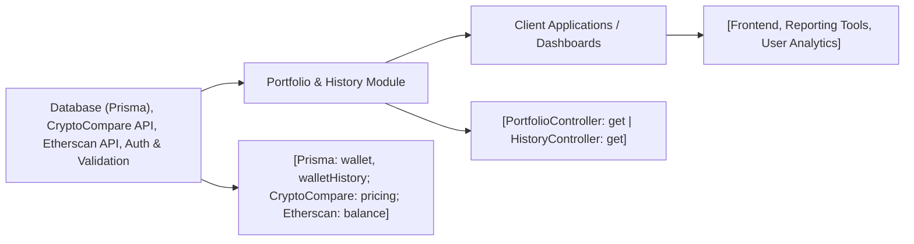

# Portfolio and History Module

## Overview
The Portfolio and History modules are responsible for providing users with insight into their cryptocurrency wallet's current status and historical performance. These modules expose API endpoints that allow clients to access up-to-date portfolio valuations, asset allocations, price fluctuations, and a record of historical wallet values. Together, they enable users and integrated systems to track, analyze, and display portfolio dynamics over time.

## Key Features

- **Portfolio Data Retrieval**: Supplies comprehensive, real-time portfolio information including current value, price data, asset allocation, and daily changes for a given wallet.
- **Historical Performance Access**: Offers filtered access to historical data for a wallet, allowing users or downstream services to analyze how the wallet's value evolved across time.
- **API-based Integration**: Provides RESTful endpoints for easy consumption and integration with client applications, dashboards, or other backend services.
- **External Price Aggregation**: Utilizes trusted third-party services for up-to-date price and balance data, ensuring result accuracy for users.
- **Data Consistency & Security**: Integrates with internal authentication and request validation mechanisms to ensure user-specific data protection and input correctness.

## System Errors

- **Invalid Wallet ID**: If a non-numeric or non-existent wallet ID is provided, the API responds with a 400 Bad Request and a descriptive error message.
  - **Resolution**: Ensure the wallet ID param in the request is a valid integer that maps to an existing wallet.
  
- **Wallet History Not Found**: When no historical data exists for a wallet, the history endpoint returns a 404 Not Found response.
  - **Resolution**: Confirm the wallet has recorded history entries or adjust filter criteria.

- **Dependency/API Errors**: Failures when calling upstream APIs (e.g., price providers) result in an internal server error (500) with error details.
  - **Resolution**: Verify external API availability and relevant environment variables (like API keys); check network access.

- **Internal Server Errors**: Generic error handler responds with a 500 status for unexpected issues.
  - **Resolution**: Review error message for diagnostic clues; check service logs and external dependencies.

## Usage Examples

```typescript
// Retrieve current portfolio data for a wallet (portfolio endpoint)
GET /api/portfolio/:id
// Response example:
{
  "allocation": 1,
  "price": 2350.65,
  "dailyPrice": 1.2,
  "value": 0.45,
  "dailyValue": 0.01
}

// Retrieve wallet history with optional start date filter
GET /api/history/:id?startDate=2023-08-01
// Response example:
[
  {
    "id": 42,
    "walletId": 1,
    "date": "2023-08-01T00:00:00.000Z",
    "value": 0.43
  },
  // ...
]
```

## System Integration

