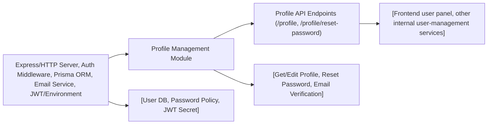

# Profile Management

## Overview
The Profile Management module provides authenticated users with essential capabilities to view and update their account profile, including editing their name and email and securely resetting their password. This module acts as a central user-facing point for managing identity and personal information, and is typically accessed via API endpoints after authentication.

## Key Features

- **Get Profile**: Retrieve the current user's profile data (name, email) for display and use in applications.
- **Edit Profile**: Update user profile details (name and email). If the email is changed, email verification is triggered.
- **Reset Password**: Allow users to change their password by providing the old and new password, ensuring security and compliance.

## System Errors

- **Missing Credentials**: If required fields (such as email, oldPassword, or newPassword) are missing from a request, a `400 Bad Request` is returned with details about the missing data.  
  _Resolution_: Ensure all required fields are included in the request body.

- **Duplicate Email (P2002 Error)**: Attempting to change an email to one that is already in use triggers a Prisma `P2002` error, resulting in an account edition failure message.  
  _Resolution_: Use an email address that is not already registered in the system.

- **Password Validation Error**: If password requirements are not met (length and character complexity), a validation error is returned with a descriptive message.  
  _Resolution_: Update the password to meet the system's minimum requirements.

- **New Password Same As Old**: If the new password matches the old password, a `400 Bad Request` is returned indicating the requirement for a different password.  
  _Resolution_: Choose a new password that is different from the old one.

- **Old Password Incorrect**: If the provided old password is incorrect, an error message is returned.  
  _Resolution_: Double-check and provide the correct current password.

- **Internal Server Error**: Unexpected errors in profile operations return a `500 Internal Server Error` with the error message for troubleshooting.  
  _Resolution_: Investigate logs or error messages for more information.

## Usage Examples

```typescript
// Retrieving current user's profile (GET /profile)
fetch("/profile", {
  method: "GET",
  headers: {
    Authorization: "Bearer <token>",
  }
}).then(res => res.json());

// Editing profile (PATCH /profile)
fetch("/profile", {
  method: "PATCH",
  headers: {
    "Content-Type": "application/json",
    Authorization: "Bearer <token>",
  },
  body: JSON.stringify({ name: "Alice Doe", email: "alice@example.com" })
}).then(res => res.json());

// Resetting password (POST /profile/reset-password)
fetch("/profile/reset-password", {
  method: "POST",
  headers: {
    "Content-Type": "application/json",
    Authorization: "Bearer <token>",
  },
  body: JSON.stringify({ oldPassword: "OldPassw0rd!", newPassword: "NewPassw0rd!" })
}).then(res => res.json());
```

## System Integration

