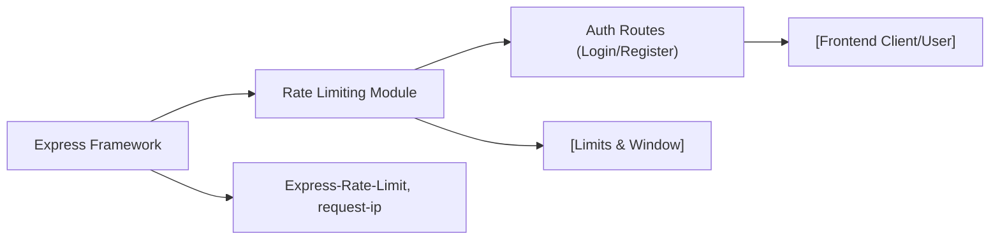

# Rate Limiting

## Overview
The Rate Limiting module enforces request throttling for sensitive authentication endpoints, specifically login and registration. Its primary purpose is to prevent abuse, brute force attacks, and protect server resources by limiting the number of requests a client can make within a fixed time window. This module is typically applied as middleware in the authentication routes of an Express-based backend.

## Key Features
- **Login Rate Limiting**: Restricts each client to a maximum of 5 login attempts within a 15-minute window. If the limit is exceeded, further attempts from the same client IP are temporarily blocked.
- **Registration Rate Limiting**: Restricts each client to a maximum of 3 registration attempts within a 15-minute window. If the limit is exceeded, further attempts from the same client IP are temporarily blocked.
- **IP-Based Throttling**: Rate limits are determined based on the client’s IP address to ensure fair use across clients and prevent circumvention through repeated requests from the same source.
- **Standardized Error Responses**: When the request limit is exceeded, the module returns a clear 429 "Too Many Requests" status code with a user-friendly message.

## System Errors
- **Too Many Requests**:  
  - **Description**: Triggered when a client’s request count exceeds the allowed login or registration attempts in the 15-minute window.  
  - **Resolution**: The client must wait for the time window (15 minutes) to expire before making new requests.  
  - **HTTP Status Code**: 429  
  - **Message**: `"Too many requests from this IP, please try again after 15 minutes"`
- **IP Detection Failure** (Edge Case):  
  - **Description**: If the client IP is not detected, the module falls back to an empty string as the identifier, which could cause all “undetected” traffic to share a rate limit.  
  - **Resolution**: Ensure the request originates from a routable client IP. This is typically handled by reverse proxies or correct header forwarding.

## Usage Examples

```typescript
import express from "express";
import { loginLimiter, registerLimiter } from "./middleware/rate-limiter";

const app = express();

// Apply rate limiter to login route
app.post("/api/auth/login", loginLimiter, (req, res) => {
  // login logic here
});

// Apply rate limiter to registration route
app.post("/api/auth/register", registerLimiter, (req, res) => {
  // registration logic here
});

app.listen(3000, () => {
  console.log("Server running on port 3000");
});
```

## System Integration


