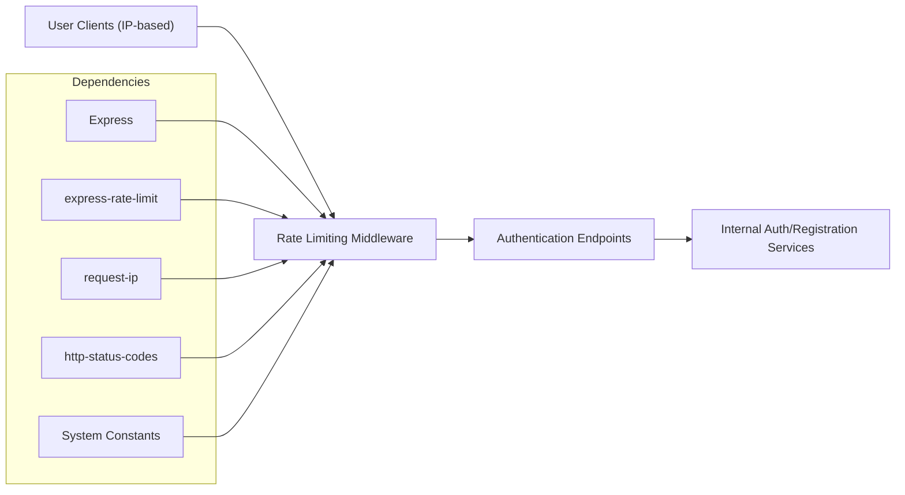

# Rate Limiting Middleware

## Overview
The Rate Limiting Middleware is responsible for controlling the number of authentication-related requests (login and registration) made from a single client within a specified time window. Its core purpose is to prevent abusive usage patterns (such as brute-force attacks) by limiting the number of attempts a user can make to log in or register, thereby improving system security and resource management.

## Key Features
- **Login Rate Limiting**: Restricts the number of login attempts from a single IP address to a predefined maximum within a 15-minute window.
- **Registration Rate Limiting**: Limits the number of registration attempts from a single IP address to a predefined maximum within a 15-minute window.
- **Custom Client IP Handling**: Uses client IP address extracted in a robust way (supports proxies) to accurately apply limits per user.
- **Standardized Error Response**: Returns a consistent error message and HTTP status code when the rate limit is exceeded.

## System Errors
- **Too Many Requests**:  
  - **Description**: When the client exceeds the permitted number of requests (5 login attempts or 3 registration attempts per 15-minute window).
  - **Resolution**: The client must wait 15 minutes before making further requests. The system responds with HTTP 429 (Too Many Requests) and the message:  
    `"Too many requests from this IP, please try again after 15 minutes"`

## Usage Examples

```typescript
import express from "express";
import { loginLimiter, registerLimiter } from "./middleware/rate-limiter";

const app = express();

app.post("/login", loginLimiter, (req, res) => {
  // login handler
});

app.post("/register", registerLimiter, (req, res) => {
  // registration handler
});
```

## System Integration


- **Dependencies**: Express, express-rate-limit, request-ip, HTTP status codes, and authentication-related constants.
- **This Module**: The Rate Limiting Middleware operates as a per-route middleware for sensitive endpoints.
- **Used By**: Login and registration endpoints to enforce request limits per IP address.
- **Consumers**: Any upstream system or frontend application attempting authentication operations via the API.

---

This documentation ensures you understand where and why to use the Rate Limiting Middleware. For any extension (additional endpoints, different rate policies), configure similar `rateLimit` middlewares as needed.