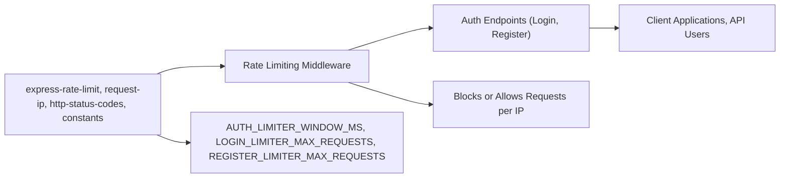

# Rate Limiting Middleware

## Overview
The Rate Limiting Middleware regulates incoming requests to critical authentication endpoints by limiting the number of requests allowed from a single client IP within a defined time window. This protects the API from brute-force attacks and prevents abuse of the login and registration endpoints, ensuring fair usage and improved security.

## Key Features
- **Login Rate Limiting**: Restricts the number of login attempts from a single IP to a small fixed number within a 15-minute window. Prevents brute-force login attacks and excessive load on the authentication system.
- **Register Rate Limiting**: Restricts the number of registration attempts from a single IP to an even lower threshold within the same time window. Prevents abuse of user registration and potential resource exhaustion.
- **IP-Aware Request Counting**: Uses the true client IP (even behind proxies) to accurately limit requests per end user.
- **Custom Error Responses**: Returns a clear message and HTTP 429 (Too Many Requests) status code when limits are exceeded, guiding clients on remediation.

## System Errors
- **Too Many Requests (HTTP 429)**: Returned when a user exceeds the allowed number of requests in the time window.
  - **Resolution**: Wait for 15 minutes before retrying. No further requests will be processed from the offending IP until the window resets.
- **IP Detection Failures**: If client IP cannot be determined, all such requests will be considered from the same (empty) IP address.
  - **Resolution**: Ensure requests include proper forward headers in proxy or CDN setups for accurate rate limiting.

## Usage Examples

```typescript
import express from "express";
import { loginLimiter, registerLimiter } from "./middleware/rate-limiter";

const app = express();

app.post('/auth/login', loginLimiter, (req, res) => {
  // Handle login
});

app.post('/auth/register', registerLimiter, (req, res) => {
  // Handle registration
});

app.listen(3000);
```

## System Integration


