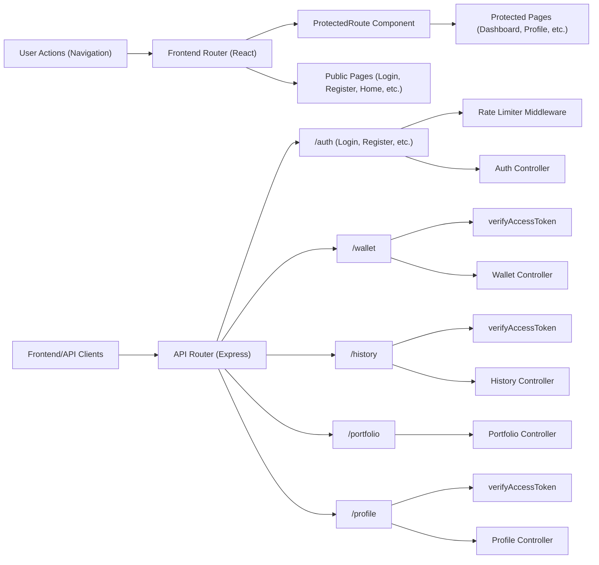

# Routing Module

## Overview
The Routing module manages how HTTP requests are directed to the appropriate business logic in both the backend (REST API) and frontend (React client). It defines all available API endpoints on the server, groups them by features (auth, wallet, portfolio, profile, history), and ensures access control by integrating authentication middleware. On the client side, it maps URL paths to React pages, restricting access to protected routes using authentication state.

## Key Features

- **API Endpoint Grouping**: Organizes backend services into distinct route groups (e.g., /auth, /wallet, /portfolio, /profile, /history) reflecting core application domains.
- **Authentication Handling**: Restricts access to sensitive API endpoints and frontend pages by verifying user authentication through middleware (backend `verifyAccessToken`, frontend `ProtectedRoute`).
- **Public and Protected Routes**: Supports both unrestricted (e.g., login, register) and protected (e.g., dashboard, wallets, profiles) resources for seamless user experience and security.
- **Middleware Integration**: Enables extensible request processing (e.g., rate limiting, access token verification) via middleware directly in routing setup.
- **RESTful API Exposure**: Exposes intuitive, resource-based API endpoints mapping to logical business actions for integration by frontend or external clients.

## System Errors

- **Unauthorized Access (401/403)**: Users attempting to access protected API endpoints or frontend routes without valid authentication will receive an error (401 Unauthorized from API; redirect to login on UI).  
  _Resolution_: Ensure user is logged in and has a valid access token.

- **Resource Not Found (404)**: Accessing an invalid route/path returns a 404 error or shows a "not found" page.  
  _Resolution_: Verify the correct endpoint or frontend path is used.

- **Rate Limit Exceeded (429)**: Rapid or repeated requests to `/auth/login` or `/auth/register` may be blocked by rate limiters.  
  _Resolution_: Wait and try again later; ensure automated tools do not spam endpoints.

## Usage Examples

```typescript
// Backend: Register a new user via API
POST /auth/register
{
  "email": "user@example.com",
  "password": "securePassword123"
}

// Backend: Access wallet endpoints (authorization required)
GET /wallet
Authorization: Bearer <access_token>

// Frontend: React router usage with protected route
<Route
  path="/dashboard"
  element={
    <ProtectedRoute>
      <Dashboard />
    </ProtectedRoute>
  }
/>
```

## System Integration


