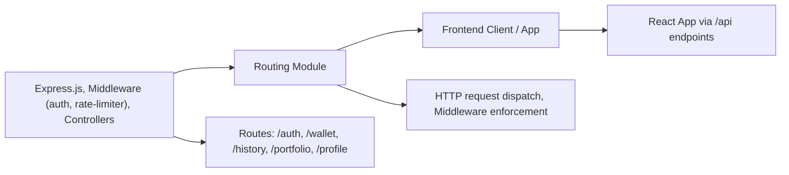

# Routing Module

## Overview
The Routing Module in this system defines and manages all server-side HTTP API endpoints, handling how requests are dispatched to backend business logic. It organizes feature-centric routers such as authentication, user wallet, transaction history, portfolio, and user profile management. Routing coordinates access control, links client-side navigation to API endpoints, and serves as the main integration point between frontend requests and backend controllers.

## Key Features

- **Authentication Routing**: Handles user login, registration, email verification, token refresh, and logout. Integrates with rate-limiting to protect against abuse.
- **Wallet Routing**: Provides routes for creating, retrieving, and deleting user wallets. Protected via access token verification middleware.
- **Transaction History Routing**: Exposes endpoints for retrieving user-specific transaction histories, also protected by authentication middleware.
- **Portfolio Routing**: Supplies endpoints to fetch portfolio details using a given ID. Open access (no user authentication enforced).
- **Profile Routing**: Offers endpoints for viewing, editing, and partially updating user profile and password, with access control restrictions.
- **Middleware Enforcement**: Applies authentication and rate-limiting middleware as required for security and fair usage.

## System Errors

- **401 Unauthorized**: Returned when access tokens are missing or invalid on protected routes (`/wallet`, `/history`, `/profile`).
  - **Resolution**: Ensure the client includes a valid access token in the request header (e.g., `Authorization: Bearer <token>`).
- **429 Too Many Requests**: Triggered by rate-limiting on login and registration endpoints.
  - **Resolution**: Wait and retry after the cooldown period or ensure automated scripts do not exceed rate limits.
- **404 Not Found**: When requesting resources by an invalid or non-existent ID (e.g., wallet or history).
  - **Resolution**: Verify resource IDs exist and are correctly formatted.
- **400 Bad Request**: Returned for malformed requests or missing required fields in POST/PATCH bodies.
  - **Resolution**: Ensure all required request payload fields are present and correctly formatted.

## Usage Examples

```typescript
// 1. Authentication - Register a new user
POST /auth/register
{
  "email": "user@example.com",
  "password": "securePassword"
}

// 2. Authentication - Login
POST /auth/login
{
  "email": "user@example.com",
  "password": "securePassword"
}

// 3. Access wallet endpoints (protected)
GET /wallet
Authorization: Bearer <access_token>

// 4. View transaction history (protected)
GET /history/12345
Authorization: Bearer <access_token>

// 5. Get portfolio info (public)
GET /portfolio/67890

// 6. Update profile (protected)
PATCH /profile
Authorization: Bearer <access_token>
{
  "username": "newUsername"
}
```

## System Integration


