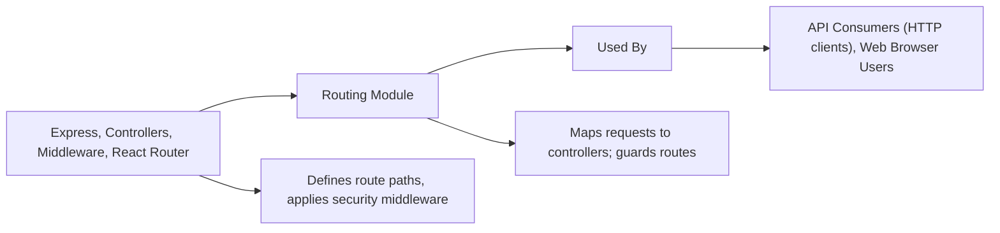

# Routing Module

## Overview
The Routing module provides the structure and organization for all API endpoints and the client-side navigation in the wallet tracker system. It acts as the central hub where request handling and response management are mapped to appropriate controllers and views. This module ensures that user and system requests are correctly routed to features such as authentication, wallet management, profile operations, transaction history, and portfolio insights.

## Key Features
- **API Endpoint Aggregation**: Consolidates and exposes RESTful endpoints under versioned prefixes (`/api/v1`), ensuring clarity and scalability for future versions.
- **Authentication Routing**: Handles user account management flows such as registration, login, logout, token refreshing, and email verification through dedicated routes.
- **Wallet Management Routing**: Enables secure creation, retrieval, and deletion of crypto wallets, and their associated histories/statistics.
- **Profile Routing**: Provides straightforward endpoints for retrieving, editing, and resetting user profile information and passwords.
- **Transaction History and Portfolio Routing**: Makes wallet-specific statistical and historical data available through clear URL mappings.
- **Middleware Integration**: Utilizes access token verification and rate-limiting middleware where appropriate to manage security and performance.
- **Protected Client Navigation**: Ensures certain client application views are only accessible to authenticated users via protected routes (`/dashboard`, `/profile`).
- **Seamless Client Routing**: Presents users with simple, descriptive URLs for core app pages (login, register, dashboard, etc.), facilitating intuitive navigation.

## System Errors
It's important to document common errors and troubleshooting specify :
- **Invalid Access Token**: Occurs on protected API routes (`/wallet`, `/history`, `/profile`) if the user's access token is missing or invalid.
  - **Resolution**: Ensure the client sends a valid token. Renew token via `/auth/refresh-access-token` if expired.
- **Rate Limit Exceeded**: Requests to login/register endpoints may be rate-limited.
  - **Resolution**: Wait the specified cooldown and try again. Avoid excessive rapid requests.
- **Route Not Found (404)**: Sending requests to undefined routes will result in a 404 error.
  - **Resolution**: Verify path correctness and consult the list of available routes.
- **Unauthorized Client Navigation**: Accessing protected client routes without authentication.
  - **Resolution**: Log in to gain access; ensure tokens and session are valid.

## Usage Examples
Practical code examples showing how to use the module:

```js
// Example: Calling the login API route from the client
fetch("/api/v1/auth/login", {
  method: "POST",
  headers: { "Content-Type": "application/json" },
  body: JSON.stringify({ email: "user@example.com", password: "secret" }),
});

// Example: Navigating to protected dashboard in client React app
import { useNavigate } from 'react-router-dom';

const goToDashboard = () => {
  navigate("/dashboard"); // Only works if authenticated
};
```

## System Integration
Complete the Mermaid diagram showing how this module integrates with the system:


