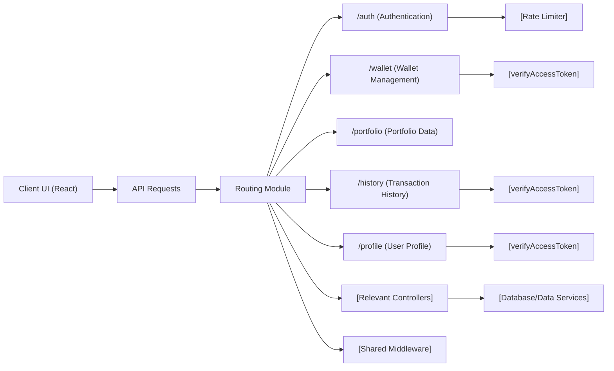

# Routing Module

## Overview
The Routing module serves as the central entry point for all backend API routes in the crypto wallet tracking application. It organizes, groups, and protects API endpoints by handling route mounting, access control, and middleware integration. The module determines how API features—such as authentication, user profile, wallet management, portfolio, and transaction history—are exposed to clients, ensuring proper security and logical grouping.

## Key Features

- **Feature Routing and Organization**: Groups logically-related endpoints into sub-routers (e.g., `/auth`, `/wallet`, `/portfolio`, `/profile`, `/history`) for maintainable and scalable API structure.
  
- **Access Control Integration**: Automatically secures sensitive endpoints (e.g., `/wallet`, `/history`, `/profile`) with authentication middleware, ensuring only authorized users can access private resources.

- **Public and Protected Endpoints**: Distinguishes between public APIs (such as registration or login) and those which require authentication (such as managing wallets, getting user profiles, or retrieving transaction histories).

- **Extensible Middleware Support**: Allows for easy addition of middleware (such as rate limiting, validation, etc.) on a per-route basis, enabling consistent cross-cutting behavior for different API resources.

## System Errors

- **401 Unauthorized**:  
  - **Description**: Attempting to access protected routes like `/wallet`, `/history`, or `/profile` without a valid access token.
  - **Resolution**: Acquire and present a valid access token, usually by logging in through `/auth/login`.

- **404 Not Found**:
  - **Description**: Requesting a non-existent route or resource under any of the mounted API groups.
  - **Resolution**: Check route paths and IDs; ensure the endpoint exists and parameters are correct.

- **429 Too Many Requests**:
  - **Description**: Excessive login or registration attempts trigger rate-limiting middleware on `/auth` routes.
  - **Resolution**: Wait for some time before retrying; avoid sending repeated requests rapidly.

## Usage Examples

```javascript
// Example: Registering a New User (public route)
POST /auth/register
Body: { "email": "user@example.com", "password": "securepw" }

// Example: Logging In (public route, rate-limited)
POST /auth/login
Body: { "email": "user@example.com", "password": "securepw" }

// Example: Getting All Wallets (protected route)
GET /wallet
Headers: { "Authorization": "Bearer <access_token>" }

// Example: Fetching Transaction History for a Wallet (protected route)
GET /history/123?startDate=2024-01-01T00:00:00Z
Headers: { "Authorization": "Bearer <access_token>" }

// Example: Updating User Profile (protected route)
PATCH /profile
Headers: { "Authorization": "Bearer <access_token>" }
Body: { "name": "Updated Name", "email": "new@example.com" }
```

## System Integration



**Legend:**  
- The Routing Module acts as the aggregator and gatekeeper for all backend API interactions.
- It enforces security via middleware, then delegates to sub-routers and controllers.
- The client only communicates with defined public/protected routes exposed here; direct access to sub-logic is not possible.
- Middleware and controllers—integrated downstream—handle validation, business logic, and data operations.