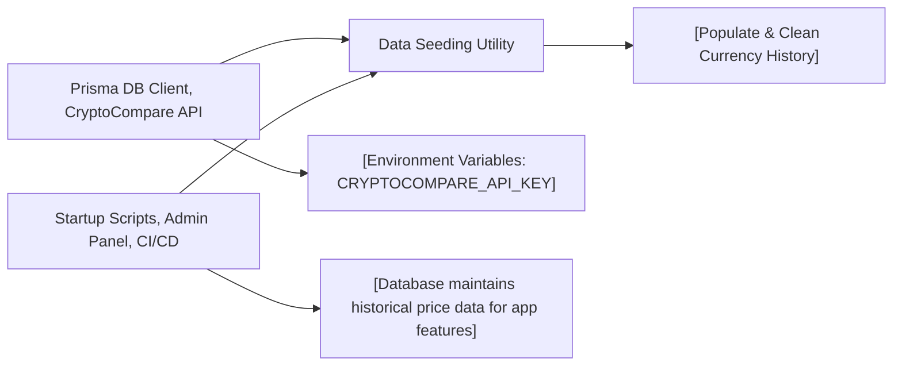

# Data Seeding Utility

## Overview
The Data Seeding Utility module automates the initialization and population of historical cryptocurrency price data into the system's database. It fetches data from external providers (specifically the CryptoCompare API), cleans up existing history, and ensures up-to-date price information for specified cryptocurrency/currency pairs. This module is critical for bootstrapping and maintaining accurate market data within the application.

## Key Features
- **Clean Historical Data**: Removes all records from the currency history table to avoid duplication and stale data before reseeding.
- **Fetch External Currency History**: Retrieves extensive historical price data for a specified cryptocurrency and fiat currency pair, using the CryptoCompare API, handling pagination and API key security.
- **Populate Database with Time-Series Data**: Inserts and updates records in both currency and currency history tables, ensuring that each price-point is either created or updated based on whether it already exists.
- **Currency Data Deduplication**: Uses upsert operations to avoid data redundancy and continuously synchronize past price changes.

## System Errors
- **API Rate Limit / Invalid Key**: Occurs if the CryptoCompare API key is missing, invalid, or exhausted.  
  _Resolution_: Confirm that the environment variable `CRYPTOCOMPARE_API_KEY` is defined and has sufficient quota.
- **Data Fetch Errors**: Network or API response failures (e.g., outage, incorrect endpoint, poor connectivity).  
  _Resolution_: Verify internet connection, API availability, and correct endpoint formatting.
- **Data Integrity Issues**: Attempting to insert undefined or malformed data entries (missing date, price, or currency info).  
  _Resolution_: Check log warnings for skipped entries and validate incoming data structures.

## Usage Examples
Practical usage when invoking the seeding utility:

```typescript
// Cleans all historical currency data in the database
await cleanCurrencyHistory();

// Fetches and populates ETH-to-EUR historical prices into the database
await populateDb("ETH", "EUR");

// Fetches historical price points for Bitcoin in USD
const btcHistory = await getCurrencyHistory("BTC", "USD");
console.log(btcHistory); // [{ date: Date, price: number }, ...]
```

## System Integration


