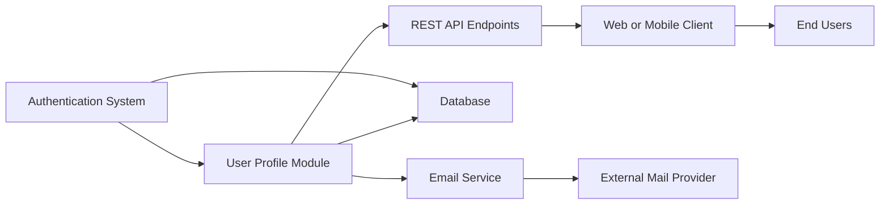

# User Profile Module

## Overview
The User Profile module provides secure management of user profile data within the system. It enables authenticated users to view and edit their personal information (name and email), as well as securely reset their passwords. This module enforces verification controls and triggers relevant flows (e.g., email verification) in case of sensitive data changes.

## Key Features
- **Profile Retrieval**: Allows authenticated users to fetch their basic profile information (name, email).
- **Profile Update**: Enables users to update their name and email. Triggers an email verification flow when the email changes.
- **Password Reset**: Offers a secure workflow for users to change their password, validating the old password and enforcing new password policies.
- **Email Verification Triggering**: When a user updates their email address, a verification email is sent to the new address.

## System Errors
- **Email Required**: If a user attempts to edit their profile without providing an email, the system responds with a "400 Bad Request".
  - **Resolution**: Always provide an 'email' when updating the profile.
- **Account Edition Failed**: Attempting to update profile data with an already-used email address triggers this error ("400 Bad Request").
  - **Resolution**: Use a new, unique email address not already in use.
- **Old/New Password Required or Equal**: When resetting the password, both old and new passwords must be present and different.
  - **Resolution**: Supply both passwords; the new password must not equal the old one.
- **Old Password Incorrect**: If the provided old password does not match current credentials.
  - **Resolution**: Supply the correct current password.
- **Internal Server Error**: Any unexpected failure (e.g., database issues) will return a generic error.
  - **Resolution**: Consult logs or administrator for further diagnosis.

## Usage Examples

```typescript
// 1. Retrieve user profile (Express route middleware)
app.get('/profile', authMiddleware, ProfileController.get);

// 2. Edit user profile (Express route middleware)
app.put('/profile', authMiddleware, ProfileController.edit);
// JSON body: { "name": "Jane Doe", "email": "jane@example.com" }

// 3. Reset password (Express route middleware)
app.post('/profile/reset-password', authMiddleware, ProfileController.resetPassword);
// JSON body: { "oldPassword": "old123", "newPassword": "new456" }
```

## System Integration


