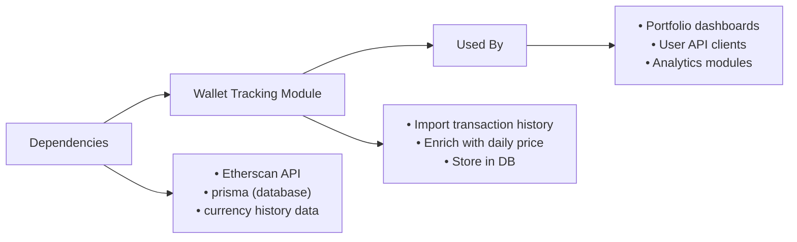

# Wallet Tracking Module

## Overview
The Wallet Tracking module enables users to add, view, and remove cryptocurrency wallets (currently focused on Ethereum) within the system. It automatically imports transaction history from Etherscan, enriches this with daily ETH price data, and computes a historical valuation for each wallet. This allows users and integrated systems to monitor wallet balances and their value in fiat currency over time.

## Key Features

- **Wallet Creation & History Import**: When a user adds a wallet, the module automatically fetches all relevant blockchain transactions (external & internal) using Etherscan, then aggregates daily balance change and ETH valuation.
- **Historical Valuation Enrichment**: Combines raw transaction data with daily ETH price history to provide a record of the wallet’s value in currency across time.
- **Wallet Listing**: Retrieves all wallets associated with a user, for display or integration with portfolio dashboards.
- **Wallet Removal & Cleanup**: Deletes a wallet and all its associated historical data, ensuring user privacy and consistency.

## System Errors

- **Wallet Not Found**: Occurs if a requested wallet for deletion does not exist.  
  _Resolution_: Returns a `404 Not Found` error; ensure the wallet ID is correct and belongs to the current user.

- **ETH Currency Not Found**: Triggered during wallet creation if the reference fiat currency (ETH) is missing from the database.  
  _Resolution_: Validate system currency setup before creating wallets.

- **Invalid Parameters**: Happens if required fields (address or title) are missing or wallet ID is invalid.  
  _Resolution_: Ensure all required fields are provided and wallet IDs are numbers.

- **External API Failure**: If Etherscan API is unavailable or rate-limited, wallet history import may fail.  
  _Resolution_: Retry or investigate Etherscan connectivity.

## Usage Examples

```typescript
// Add a new wallet and build its history for a user account
const WalletController = new WalletController();

// Express.js route handlers:
app.post('/wallets', async (req, res) => {
  await WalletController.create(req, res); // Creates wallet, imports history, returns wallet details
});

// Retrieve a user's wallets
app.get('/wallets', async (req, res) => {
  await WalletController.all(req, res); // Returns all wallets for current user
});

// Remove a wallet and its history
app.delete('/wallets/:id', async (req, res) => {
  await WalletController.delete(req, res); // Deletes wallet and historical data
});
```

## System Integration



**Integration Points:**  
- _Depends on Etherscan API_ for transaction data.  
- _Requires internal currency history_ for accurate asset valuation.  
- _Exposes API endpoints (`create`, `all`, `delete`)_ for external modules and UI.  
- _Feeds wallet valuation data to higher-level portfolio management and analytics systems._