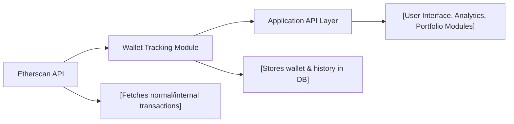

# Wallet Tracking Module

## Overview
The Wallet Tracking module allows users to add, view, and remove Ethereum wallets from their account, automatically tracking historical balances and value changes over time. On wallet registration, it retrieves all relevant blockchain transactions, computes daily balances, and stores this history in the application database, mapped to real ETH prices. It serves as a foundational building block for personal crypto portfolio tracking within the system.

## Key Features

- **Wallet Registration with History Tracking**:  
  Users can register an Ethereum wallet address; upon registration, the module collects all historical transactions (normal and internal) from Etherscan APIs, calculates daily balances, and enriches data with daily ETH prices for accurate historical value tracking.

- **Automatic Value Calculation**:  
  For each transaction and day, computes the true wallet value in both ETH and the corresponding market value (using local historical price records). This provides users with accurate, date-by-date asset valuations.

- **Wallet List Management**:  
  Enables users to view all their tracked wallets and remove wallets when no longer needed. Associated history is automatically cleaned up on wallet removal.

## System Errors

- **Invalid Wallet ID**:  
  _Description_: A non-numeric or malformed wallet ID is supplied for wallet operations.  
  _Resolution_: Ensure the wallet ID in API requests is a valid integer.

- **Wallet Not Found**:  
  _Description_: Attempt to access or remove a wallet that does not exist or does not belong to the requesting user.  
  _Resolution_: Check that the wallet exists in the user's list before performing the operation.

- **ETH Currency Not Found**:  
  _Description_: The system cannot find the "ETH" currency in its reference database during wallet creation (required for value mapping).  
  _Resolution_: Verify system setup to ensure the "ETH" currency is present in the currencies table.

- **Etherscan API Errors**:  
  _Description_: The external Etherscan API returns an error or rate limit problem during transaction retrieval.  
  _Resolution_: Check API key validity, permissions, or retry later. Persistent errors may require contacting support.

## Usage Examples

```typescript
// Register a new wallet for tracking (Express/REST example)
POST /wallets
Content-Type: application/json
Authorization: Bearer <user_token>
{
  "address": "0xd0b08671ec13b451823ad9bc5401ce908872e7c5",
  "title": "My Main Wallet"
}
// Response: { id: 123, address: "...", title: "...", ... }

// List all wallets for the current user
GET /wallets
Authorization: Bearer <user_token>
// Response: [{ id, address, title, ... }, ...]

// Delete a wallet from tracking
DELETE /wallets/123
Authorization: Bearer <user_token>
// Response: 204 No Content
```

## System Integration


