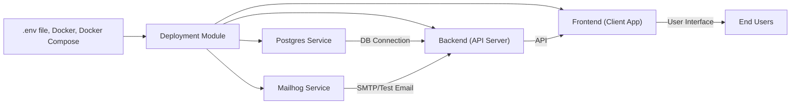

# Deployment Module

## Overview
This module orchestrates and simplifies the deployment of the Hetic Crypto API application, enabling developers to rapidly launch both backend and essential infrastructure services using Docker Compose. It ensures that all supporting services (database, email testing) are consistently provisioned and configured, providing a stable foundation for application development, testing, and production deployments.

## Key Features

- **Containerized Infrastructure**: Quickly provision and manage essential services (PostgreSQL database and Mailhog test email server) via Docker Compose for consistent environments.
- **Environment Configuration Management**: Uses a centralized `.env` file to pass critical settings (database credentials, API keys, ports, etc.) into containers, ensuring secure and reproducible deployments.
- **Service Port Mapping**: Exposes necessary ports (PostgreSQL, Mailhog SMTP, and Mailhog Web UI) to facilitate local development and debugging.
- **Volume Persistence**: Employs Docker volumes to persist database and mail data, ensuring data durability across container restarts or rebuilds.

## System Errors

- **Database Connection Error**: The application cannot connect to PostgreSQL (e.g., due to wrong credentials or port conflicts).
  - **Resolution**: Verify the values in your `.env` match what's required (e.g., `POSTGRES_USER`, `POSTGRES_PASSWORD`, `POSTGRES_DB`). Ensure port 5432 is available and not blocked.
- **Mailhog Accessibility Error**: Unable to access the Mailhog web UI.
  - **Resolution**: Confirm Mailhog is running (`docker ps`). Visit `http://localhost:8025` in your browser. If unavailable, ensure port 8025 is free and not firewalled.
- **Environment Variable Misconfiguration**: Services fail to start due to missing or malformed `.env` entries.
  - **Resolution**: Copy `.env.example` to `.env` and fill out all placeholders before starting the stack.

## Usage Examples

```bash
# 1. Create your .env file from the provided example
cp backend/.env.example backend/.env
# Edit backend/.env and set values as needed

# 2. Start the backend infrastructure
cd backend
docker-compose up -d

# 3. Start the backend application (in a separate shell)
bun run dev

# 4. Start the frontend client (from root or client directory)
cd ../client
npm install
npm start

# 5. Access Services:
#    - PostgreSQL: localhost:5432 (for backend connectivity)
#    - Mailhog email UI: http://localhost:8025
#    - Backend API: runs on port specified in .env (e.g., http://localhost:8080)
#    - Frontend URL: typically http://localhost:3000
```

## System Integration


