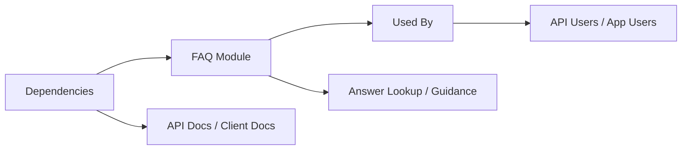

# FAQ Module

## Overview
The FAQ module provides users with quick answers to common questions about the Hetic Crypto API wallet tracker system. It serves as a centralized information point guiding users on features, system workflows, troubleshooting, and best practices for both the API and client applications.

## Key Features
- **Centralized Frequently Asked Questions**: Consolidates answers to the most common questions about using the wallet tracker platform, including account management, wallet operations, and data visualization.
- **System Onboarding Guidance**: Helps new users understand the setup process, main flows, and how to get started across the API backend and client frontend.
- **Troubleshooting Support**: Offers clear solutions to typical errors and issues encountered during authentication, wallet operations, and profile management.
- **Integration Documentation Pointer**: Directs users to key API endpoints and UI navigation routes for performing main operations in the ecosystem.

## System Errors
It's important to document common errors and troubleshooting specifics:
- **Authentication Errors**: Issues with login, registration, or email verification. Resolution: Ensure credentials are correct and email is verified through the `/auth/verify-email/<token>` endpoint.
- **Wallet Not Found**: Occurs when accessing a deleted or nonexistent wallet. Resolution: Use `/api/v1/walletId` with a valid wallet ID, or create a new wallet.
- **Token Expiry**: Access or refresh token has expired or is invalid. Resolution: Use `/auth/refresh-access-token` to obtain a new token.
- **Profile Update Failures**: Errors while updating profile or password. Resolution: Ensure correct payload and authentication for the `/profile` or `/profile/password` patch endpoints.

## Usage Examples
Practical code examples showing how to use the module:

```javascript
// Example: Registering a user via API (client-side fetch)
fetch('/api/v1/auth/register', {
  method: 'POST',
  body: JSON.stringify({ email: 'user@example.com', password: 'securePass123' }),
  headers: { 'Content-Type': 'application/json' }
})
  .then(response => response.json())
  .then(data => console.log('Registration Success:', data));

// Example: Fetching wallets after authentication
fetch('/api/v1/', {
  method: 'GET',
  headers: { Authorization: 'Bearer <access_token>' }
})
  .then(res => res.json())
  .then(wallets => console.log('My Wallets:', wallets));

// Example: Accessing the dashboard in the client app (React Router)
import { useNavigate } from 'react-router-dom';
const navigate = useNavigate();
navigate('/dashboard');
```

## System Integration


