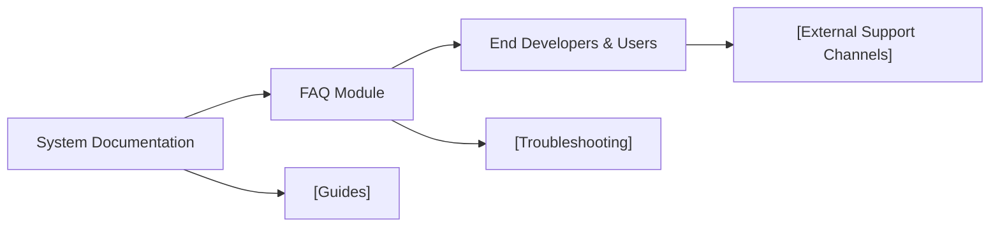

# FAQ Module

## Overview
The FAQ (Frequently Asked Questions) module serves as a centralized resource where users can quickly find answers to common questions regarding the Hetic Crypto API project. Its main purpose is to improve the developer and user experience by offering immediate guidance on typical issues, features, workflows, and general troubleshooting. The FAQ is a static resource and does not expose any active API endpoints, but it is an essential part of the documentation suite for both backend and frontend systems.

## Key Features
- **Quick Access to Common Answers**: Aggregates answers to the most frequently asked user and developer questions, minimizing support overhead and user confusion.
- **Coverage of Full Stack**: Addresses questions relevant to both the backend API (e.g., authentication, wallet functionality) and the client application (e.g., build, run, deployment).
- **Development Troubleshooting**: Provides solutions for known issues (like build failures or API errors), helping developers resolve them without external research.
- **Onboarding Support**: Assists new users and contributors with essential information about project structure, key workflows, and expected integrations.

## System Errors
It's important to document common errors and troubleshooting specify :
- **API Authentication Failure**: Occurs when invalid credentials are provided to API endpoints. Resolution: Ensure correct registration, verify email, and use a valid token obtained from `/auth/login`.
- **CORS Issues when Developing Frontend**: The client cannot reach the backend API due to CORS policy. Resolution: Make sure both backend and frontend are run on allowed origins and CORS headers are correctly set in the backend server.
- **Missing Dependency (Backend)**: Occurs if Bun dependencies are not installed. Resolution: Run `bun i` in the backend directory before starting the server.
- **Build Failures (Frontend)**: The React app fails to build or run. Resolution: Ensure you have installed all dependencies via `npm install` and that your Node version matches `create-react-app` requirements.

## Usage Examples
Practical code examples showing how to use the module:

```markdown
# Example: Locating Answers in the FAQ

- **Q:** How do I register a new user via the API?
- **A:** See "POST /auth/register" in the API section.

- **Q:** How can I visualize a wallet's statistics?
- **A:** Use the `/portfolio/<walletId>` API endpoint. See the Wallet FAQ for details.

- **Q:** The client won't build, what should I do?
- **A:** Check the FAQ section "Build Failures (Frontend)" for troubleshooting steps.

# Example: Onboarding with FAQ

1. Read through the "Development Troubleshooting" section before starting local development.
2. Reference the "System Errors" section for solutions if you encounter error codes or unexpected behavior.
```

## System Integration
Complete the Mermaid diagram showing how this module integrates with the system:


