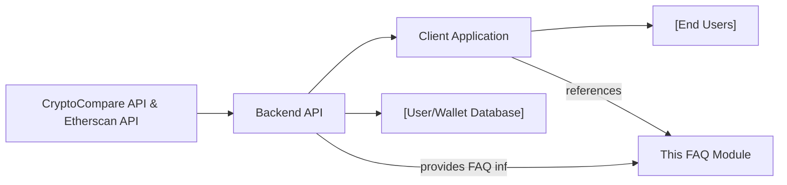

# Frequently Asked Questions (FAQ)

## Overview
This module provides answers to commonly asked questions regarding the wallet tracker system, covering backend APIs, client usage, and integration points. It helps developers and users quickly find essential information about how the system works, its capabilities, and troubleshooting best practices.

## Key Features
- **System Features Reference**: Describes the core functionalities available in both backend APIs and client interfaces.
- **Usage Guidance**: Offers clear instructions on typical workflows and UI/API entry points.
- **Troubleshooting Support**: Addresses frequent errors with recommended resolutions.

## System Errors
It's important to document common errors and troubleshooting specifically:

- **Authentication Failure**: Occurs when credentials are incorrect or tokens expire. Ensure credentials are valid or refresh the token using `/auth/refresh-access-token`.
- **Email Not Verified**: Users cannot access certain features until they verify their email via the `/auth/verify-email/<token>` route. Check your email and use the provided verification link.
- **Wallet Not Found**: Attempts to access non-existent wallet IDs return an error. Verify the wallet ID exists by listing wallets using `/api/v1/wallet/`.
- **Permission Denied**: Accessing resources without sufficient permissions will be blocked. Ensure you are authenticated and have the appropriate access rights.

## Usage Examples
Practical code examples showing how to use the module:

```http
// Register a new user
POST /api/v1/auth/register
Content-Type: application/json

{
  "email": "user@example.com",
  "password": "securepassword"
}

// Log in and receive tokens
POST /api/v1/auth/login
Content-Type: application/json

{
  "email": "user@example.com",
  "password": "securepassword"
}

// Fetch user wallets (after authentication)
GET /api/v1/wallet/
Authorization: Bearer <access_token>

// Retrieve portfolio statistics for a wallet
GET /api/v1/portfolio/<walletId>
Authorization: Bearer <access_token>
```

## System Integration
Complete the Mermaid diagram showing how this module integrates with the system:


