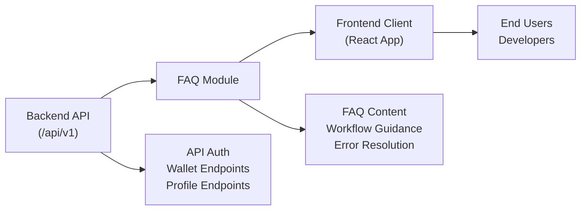

# FAQ Module

## Overview
The FAQ module centralizes frequently asked questions about the Monolith crypto wallet tracker system. Its purpose is to provide users and developers with quick answers about account management, wallet features, system architecture, and troubleshooting. It ensures consistent onboarding and clarifies how the wallet tracker ecosystem works across backend (API) and frontend (client).

## Key Features
- **Comprehensive Knowledge Base**: Aggregates answers regarding authentication, wallet management, and user profile actions.
- **System Behavior Clarification**: Explains how API and client modules interact for typical workflows (e.g., registration, login, portfolio retrieval).
- **Troubleshooting Guidance**: Helps identify common errors and quick ways to resolve issues related to account creation, wallet handling, and backend connectivity.
- **Feature Discovery**: Highlights available endpoints and UI features to guide users and developers toward correct usage.

## System Errors
It's important to document common errors and troubleshooting specify :
- **Authentication Failure**: Occurs when credentials are incorrect or tokens expire. Solution: Re-login or use the refresh access token endpoint.
- **Wallet Not Found**: Triggered when querying a non-existent wallet ID. Solution: Verify wallet existence with the wallet listing endpoint before making ID-based requests.
- **Email Verification Invalid/Expired**: When using an expired or invalid token for email verification. Solution: Request a new verification email and retry.
- **API Connectivity Issues**: Backend server is down or unreachable. Solution: Check server status and network connection; ensure the backend is running (see backend README).
- **Frontend Build/Runtime Errors**: Client app fails to load, often due to misconfiguration or build issues. Solution: Rebuild with `npm run build` and ensure environment variables are set correctly.

## Usage Examples
Practical code examples showing how to use the module:

```js
// Example: Register a User via API
fetch('/api/v1/auth/register', {
  method: 'POST',
  headers: { 'Content-Type': 'application/json' },
  body: JSON.stringify({ email: 'user@example.com', password: 'securePass123' }),
});

// Example: Retrieve Wallet List (after authentication)
fetch('/api/v1/')
  .then(res => res.json())
  .then(wallets => console.log(wallets));

// Example: Verify Email
fetch('/api/v1/auth/verify-email/<token>');

// Example: Client App Start (React)
npm start
// Then navigate to http://localhost:3000 in your browser.
```

## System Integration
Complete the Mermaid diagram showing how this module integrates with the system:

