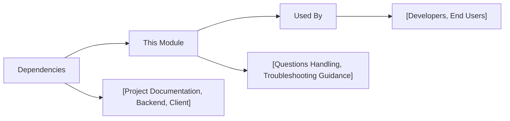

# FAQ Module

## Overview
The FAQ module provides answers to common questions regarding the usage, configuration, and troubleshooting of the Hetic Crypto API project. Its purpose is to help users and developers quickly resolve frequent issues and better understand how to interact with both the backend API and client application within the overall system.

## Key Features
- **Common Questions Coverage**: Central location for answers to typical user and developer questions, reducing support needs and accelerating onboarding.
- **System Guidance**: Directs developers to the appropriate sections in project documentation for further information about API usage, backend setup, and client application workflows.
- **Troubleshooting**: Helps diagnose and resolve frequent issues in local development, deployment, or use of public APIs.

## System Errors
It's important to document common errors and troubleshooting specifics:
- **Dependency Installation Issues**: If you encounter missing package errors, ensure you have run `bun i` (backend) or `npm install` (client) to install all dependencies.
  - _Resolution_: Install the required dependencies for each project before running any scripts.
- **API Not Responding**: Accessing the API routes without starting the backend server will result in connection errors.
  - _Resolution_: Run `bun dev` in the backend directory to start the development server.
- **Database Migration Errors**: If you see errors related to the database or Prisma client, the likely cause is missing or outdated migrations.
  - _Resolution_: Run `bunx prisma migrate dev` and `bunx prisma generate` to synchronize the database schema and generate the client.
- **Client Won't Start**: If the React client does not start or displays lint errors, make sure your dependencies are up to date and you are running Node.js in a supported environment.
  - _Resolution_: Run `npm install` and ensure you use a Node.js version compatible with Create React App.

## Usage Examples
Practical code examples showing how to use the module:

```bash
# Backend Setup Example
cd backend
bun i                    # Install backend dependencies
bun dev                  # Start backend API server (exposes endpoints at /api/v1)

# Client Setup Example
cd client
npm install              # Install client dependencies
npm start                # Launch the React app at http://localhost:3000

# Accessing API Endpoints (after backend server is running)
curl -X POST http://localhost:3001/api/v1/auth/register
curl http://localhost:3001/api/v1/wallet
```

## System Integration
