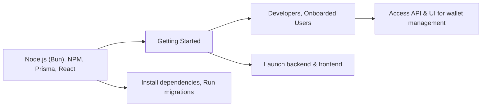

# Getting Started

## Overview
The **Getting Started** module guides developers and users through setting up and launching the Hetic Crypto API system. It explains how the backend (API server) and frontend (client application) work together, and helps new collaborators quickly get the entire platform running for local development or evaluation purposes. This module is crucial for anyone onboarding to the project or seeking to understand the system’s main entry points.

## Key Features
- **Backend Initialization**: Explains how to install dependencies, run migrations, and launch the API server for wallet tracking and data analysis.
- **Frontend Initialization**: Details how to start and interact with the client application to visualize and manage cryptocurrency wallets.
- **Development Workflow Guidance**: Outlines core workflows for building, testing, and deploying both client and server components.
- **Project Architecture Overview**: Summarizes the structure and integration points between the backend API and the frontend client.

## System Errors
- **Backend Launch Errors**: If dependencies aren't installed or migration steps are skipped, the API server may not start.  
  **Resolution**: Run `bun i` to install dependencies and `bunx prisma migrate dev` to apply database migrations before launching with `bun dev`.
- **Frontend Start Failure**: If required packages are missing or the backend isn’t running, the client may not load properly or may be unable to fetch wallet data.  
  **Resolution**: Ensure the backend is running and execute `npm install` followed by `npm start` in the client directory.
- **API Connectivity Issues**: The client may not display live wallet or profile data due to incorrect API URLs or server not available.  
  **Resolution**: Confirm both frontend and backend are using matching API URLs (use environment variables if needed) and check that the backend server is reachable.

## Usage Examples

```bash
# Backend setup (in /backend)
bun i                        # Install backend dependencies
bunx prisma migrate dev      # Run database migrations
bunx prisma generate         # Generate Prisma client (optional)
bun dev                      # Start the API server (default port)

# Frontend setup (in /client)
npm install                  # Install frontend dependencies
npm start                    # Launch the React client (default: http://localhost:3000)
```

## System Integration


