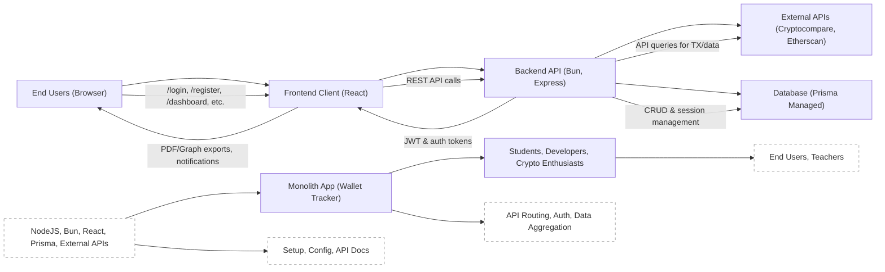

# Getting Started

## Overview
This guide explains how to set up, launch, and understand the main architectural components of the "hetic-crypto-api" project. The project provides a unified platform for tracking, visualizing, and analyzing cryptocurrency portfolios via a full-stack application. The system is comprised of a backend API and a frontend client, working together to offer end-users wallet management, portfolio insights, authentication, and more.

## Key Features

- **Unified Wallet Tracker**: Track, analyze, and visualize cryptocurrency wallet data by aggregating data from external APIs (Cryptocompare and Etherscan).
- **User Authentication & Security**: Registration, login, email verification, JWT-based session management, and password reset functionalities.
- **Wallet Management**: Create, retrieve, and delete wallets; fetch wallet history and portfolio statistics.
- **User Profile Management**: Retrieve and update account details and passwords.
- **Dashboard & Visualization**: Frontend dashboard to visualize assets and transaction history, including graphs and PDF export.
- **Role-based API Routing**: Organized API for authentication, wallet, and profile management with RESTful conventions.
- **PDF and Graph Export**: Generate PDF reports and transaction graphs from the client interface.

## System Errors

- **Port Conflict**:  
  _Description_: Development servers (backend on Bun, frontend on React) must not run on the same port.  
  _Resolution_: Ensure client (default port 3000) and backend (customizable, e.g., 4000) use different ports.

- **API Connection Issues**:  
  _Description_: The client fails to fetch data from the backend API due to misconfigured endpoints or backend not running.  
  _Resolution_: Confirm backend is running (`bun dev` in `/backend`). Check client-side API endpoint settings (proxy or environment variables).

- **Database/Prisma Errors**:  
  _Description_: Backend fails to start due to missing or outdated Prisma client/migrations.  
  _Resolution_: Run `bunx prisma generate` and apply latest migrations with `bunx prisma migrate dev`.

- **CORS/Network Errors**:  
  _Description_: Browser requests from client to API are blocked due to CORS misconfiguration.  
  _Resolution_: Ensure CORS is properly configured in the backend and that frontend is targeting the correct backend origin.

## Usage Examples

```bash
# 1. Setup backend dependencies
cd backend
bun i

# 2. Start backend development server
bun dev

# 3. Generate Prisma client (required if DB schema changes)
bunx prisma generate

# 4. (optional) Apply new Prisma migrations
bunx prisma migrate dev

# 5. Setup frontend (React app)
cd ../client
npm install

# 6. Start frontend in development mode
npm start

# 7. Access the app
# Open http://localhost:3000 in your browser

# 8. Example: Register a new user via API (POST /api/v1/auth/register)
curl -X POST http://localhost:4000/api/v1/auth/register -H "Content-Type: application/json" -d '{"email": "user@example.com", "password": "secure123"}'
```

## System Integration


