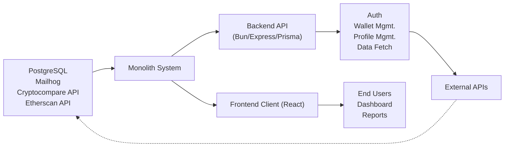

# Getting Started

## Overview
This guide explains how to launch and use the monolithic crypto wallet tracker system. The platform enables users to register accounts, manage and analyze cryptocurrency wallets, and visualize financial data. It consists of a backend API (Node/Bun, PostgreSQL, Prisma) and a frontend React client, orchestrated for rapid local development.

## Key Features

- **User Authentication**: Secure account creation, login, email verification, logout, and access token refresh, managed via API endpoints.
- **Wallet Management**: Create, list, and delete crypto wallets; fetch transaction history and portfolio statistics.
- **Profile Management**: View and update user profile information; change passwords.
- **Data Visualization**: Interactive dashboards and charts via the client interface to represent wallet transactions and statistics.
- **API Integration**: Real-time portfolio updates and historic data retrieval using Cryptocompare and Etherscan APIs.
- **Email Handling (Mailhog)**: Local email capture for development/testing account verification flows.
- **PDF Generation & Fiscal Tools**: Generate fiscal reports as PDFs (from the client).

## System Errors

- **Database Connection Error**: If the backend cannot connect to PostgreSQL, check that the database service is running (via Docker), and that `.env` variables are properly set. Restart the containers if needed.
- **API Token Errors**: If requests to Cryptocompare/Etherscan fail, ensure valid API keys are specified in the backend `.env` file.
- **Authentication Errors**: If login or token refresh fails, verify network communications, API routes, and the validity of authentication headers/tokens.
- **Email Delivery Failures**: For email verification problems, confirm that Mailhog is running (`localhost:8025`) and that the backend is pointed to Mailhog as the SMTP server.

## Usage Examples

```bash
# 1. Clone repository and install dependencies
git clone <repo-url>
cd hetic-crypto-api

# 2. Start backend services (PostgreSQL, Mailhog) using Docker
cd backend
cp .env.example .env
docker-compose up -d

# 3. Install backend dependencies and launch the server
bun i
bun dev

# 4. Generate Prisma client
bunx prisma generate

# 5. In a new terminal, start the frontend client
cd ../client
npm install
npm start

# 6. Access the client at http://localhost:3000
#    Access Mailhog UI at http://localhost:8025

# Example API flows:
# - Register user: POST /api/v1/auth/register
# - Login: POST /api/v1/auth/login
# - Add wallet: POST /api/v1/wallet/
# - List wallets: GET /api/v1/wallet/
```

## System Integration


- **Dependencies**: Monolith requires PostgreSQL for persistence, Mailhog for email, plus live connections to Cryptocompare/Etherscan APIs for market data.
- **This Module**: Coordinates all business logic, serving both web client and API.
- **Used By**: Consumed by React web client, delivering dashboards and fiscal reports to end users.

**When to Use:**  
Use this platform if you need a unified workspace for tracking, analyzing, and reporting on cryptocurrency assets, with seamless account handling and data visualization, ready for local development and team collaboration.