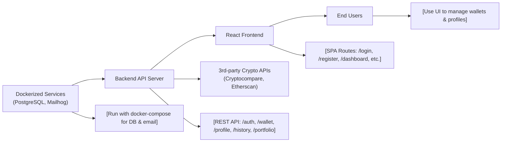

# Getting Started

## Overview
This guide will help you get the crypto wallet tracker system running locally. The project consists of a backend API (Node.js/Bun), a frontend client (React), and essential Dockerized dependencies. Designed for monitoring, analyzing, and visualizing cryptocurrency wallets, it integrates third-party APIs (Cryptocompare, Etherscan) while managing user accounts, wallets, and history.

## Key Features
- **API Server**: Exposes REST endpoints for user authentication, wallet management, history retrieval, and portfolio statistics.
- **Frontend Client**: Responsive React interface for account creation, login, dashboard, profile, and wallet visualization.
- **Dockerized Infrastructure**: Bundles PostgreSQL and Mailhog services for local development and testing.
- **Authentication and Security**: Supports registration, login, password reset, email verification, and token-based session management.
- **Crypto Data Integration**: Connects with Cryptocompare and Etherscan APIs to fetch and present wallet data.
- **PDF Export**: (Frontend) Offers fiscal PDF generation for export, usable offline.

## System Errors
- **Database Connection Failed**: The backend cannot connect to PostgreSQL (verify Docker is running and env vars are set).
  - *Resolution*: Ensure `docker-compose up` is executed, and appropriate `.env` credentials match the `docker-compose.yml`.
- **Mail Delivery Issues**: Email verification or password reset emails are not received.
  - *Resolution*: Make sure the Mailhog service is up; access the Mailhog UI at http://localhost:8025 for troubleshooting.
- **API 401 Unauthorized**: Accessing protected routes without valid tokens.
  - *Resolution*: Authenticate first and ensure your client stores and sends access tokens in API requests.
- **CORS/Network Issues**: Client cannot communicate with backend API.
  - *Resolution*: Ensure backend is running on the expected port and CORS is configured (default React dev server proxying may be needed).

## Usage Examples

### 1. Start Infrastructure

```shell
docker compose up -d
# Starts PostgreSQL and Mailhog
```

### 2. Start Backend API

```shell
cd backend
bun i
bun dev
# Backend listening, connects to Dockerized PostgreSQL, sends mail via Mailhog
```

### 3. Start Frontend

```shell
cd client
npm install
npm start
# React client available at http://localhost:3000
```

### 4. Register a User (API Example)

```http
POST http://localhost:PORT/api/v1/auth/register
Content-Type: application/json

{
  "email": "user@example.com",
  "password": "securePassword"
}
```

## System Integration


